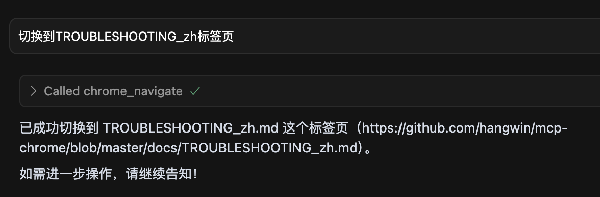

# 指引

运用大模型的时候有一个痛点:

**浏览器上有现成上下文了,但是大模型不知道**

我们不得不手动复制上下文的信息搬运给大模型

如果能直接让大模型操作浏览器,就能实现很多玩法

## 一个可能的链路

- 让大模型先搜索可用书签,比如某个购物网站
- 读取物流信息 (因为是网页,所以只需要你自己登录一次就有登录态)
- 进入指定地址对物流信息截图,并让大模型简单总结信息
- 把截图和信息推送给需求方(通过 bot 或者邮件)

这样只需要先写好一个固定的`agent`

规划每一步需要做什么

然后让`agent`按步骤执行就可以完成

最终执行效果是: 只需要对大模型说

> 我的快递到哪儿了

就能执行对应的服务拿到消息推送了

# 安装

[官方仓库中文文档](https://github.com/hangwin/mcp-chrome/blob/master/README_zh.md)

下载[仓库发布的未打包的拓展](https://github.com/hangwin/mcp-chrome/blob/master/README_zh.md)
按照[插件指南一文](./浏览器插件开发快速指南.md#最小模块)介绍的导入并执行插件

全局安装`mcp-chrome-bridge`

```bash
npm install -g mcp-chrome-bridge
# 安装完成后会自动增加$Path变量
mcp-chrome-bridge -V
# 输出版本号

# 如果 mcp-chrome-bridge 没正常添加
npm list mcp-chrome-bridge
# 输出实际的安装位置 我是 ~/.volta/bin 然后手动添加到Path就行了


# 如果 postinstall没有自动运行 需要注册一下
mcp-chrome-bridge register
```

这时候会写一个配置文件到 `Chrome NativeMessagingHosts` 文件夹里去

如果因为权限没有生效 手动启动一下脚本

Mac 如下操作

```bash
cd /Users/{user}/Library/Application\ Support/Google/Chrome/NativeMessagingHosts/
vim com.chromemcp.nativehost.json
```

文件内容如下

```json
{
  "name": "com.chromemcp.nativehost",
  "description": "Node.js Host for Browser Bridge Extension",
  "path": "your path",
  "type": "stdio",
  "allowed_origins": ["chrome-extension://hbdgbgagpkpjffpklnamcljpakneikee/"]
}
```

这里的 `path` 可能是不对的 需要搜索一下`mcp-chrome-bridge`实际的安装位置

替换成正确的路径 `<your real path>/mcp-chrome-bridge/dist/run_host.sh`

`run_host.sh` 会自动匹配可用的`node`

如果自动拉不起来,可以考虑手动执行一下

```bash
sh <your real path>/mcp-chrome-bridge/dist/run_host.sh
```

然后点插件的连接按钮


成功后`lsof -i :12306` 可以看到默认端口的`node`进程

接着配调用端

打开`cursor` 编辑`/Users/<usrname>/.cursor/mcp.json`

绑定`mcp-server-stdio.js`入口

```json
{
  "mcpServers": {
    "chrome-mcp-stdio": {
      "command": "npx",
      "args": [
        "node",
        "<your real path>/mcp-chrome-bridge/dist/mcp/mcp-server-stdio.js"
      ]
    }
  }
}
```

启动之后`cursor`会显示支持的`customer rule`

# 使用

## 查看打开的 Tab

在`Cursor Chat`输入`查看当前打开的浏览器Tab`

会自动拉起`get_windows_and_tabs`的`agent`

点击`Call Log`可以看到传递的参数

这个调用是不需要传参的


## 切换当前 Tab

大模型传参

```json
{
  "url": "https://github.com/hangwin/mcp-chrome/blob/master/docs/TROUBLESHOOTING_zh.md"
}
```

`MCP` 返回值

```json
{
  "status": "success",
  "message": "Tool executed successfully",
  "data": {
    "content": [
      {
        "type": "text",
        "text": {
          "success": true,
          "message": "Activated existing tab",
          "tabId": 163501913,
          "windowId": 163501875,
          "url": "https://github.com/hangwin/mcp-chrome/blob/master/docs/TROUBLESHOOTING_zh.md"
        }
      }
    ],
    "isError": false
  }
}
```

返回执行成功,给出提示词`message`和标签/窗口信息以及地址供大模型回复



## 总结文档内容

传参

```json
{
  "url": "https://github.com/hangwin/mcp-chrome/blob/master/docs/TROUBLESHOOTING_zh.md",
  "textContent": true
}
```

`MCP`会返回网站的内容给大模型

然后大模型读返回值总结并给出输出


