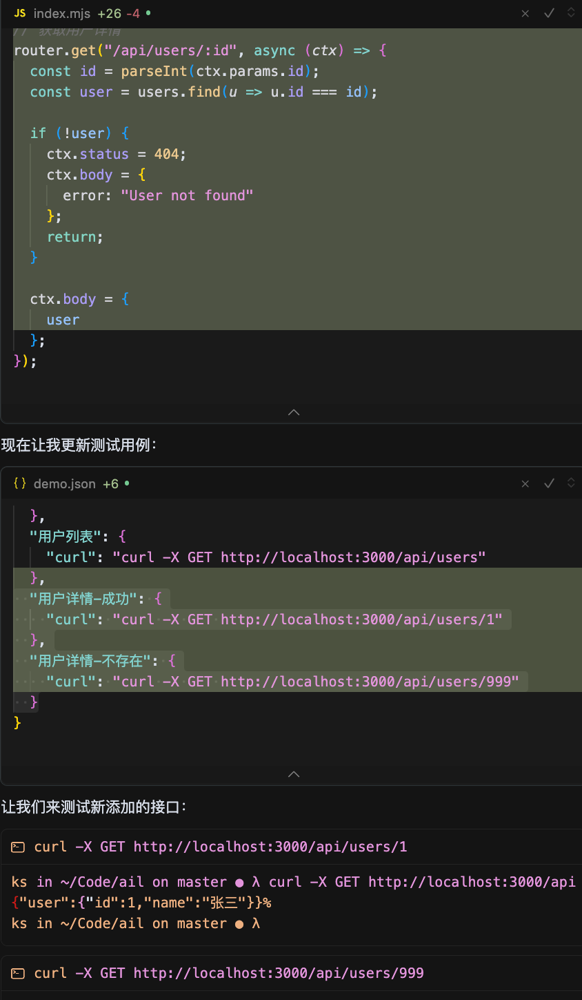

# 示例项目

> 一个简单的请求返回

## 创建项目

```bash
mkdir ail
cursor ./ail
git init
pnpm init
volta pin node@22
pnpm add koa@3 @koa/router
```

## 示例响应

```javascript
import Koa from "koa";
import Router from "@koa/router";

const app = new Koa();
const router = new Router();

router.get("/", async (ctx) => {
  ctx.body = {
    message: "Hello World",
  };
});

router.get("/api/users", async (ctx) => {
  ctx.body = {
    users: [
      { id: 1, name: "张三" },
      { id: 2, name: "李四" },
    ],
  };
});

app.use(router.routes());
app.use(router.allowedMethods());

app.listen(3000);
```

## 生成测试

正常应该是执行请求测试,这里为了方便直接用`curl`构建

```json
{
  "页面返回": {
    "curl": "curl http://localhost:3000"
  },
  "用户列表": {
    "curl": "curl -X GET http://localhost:3000/api/users"
  }
}
```

让`ai agent`执行对应的代码返回结果

## 提示 promot

> 执行 `test` 文件夹下的 `curl` 指令 预期都返回 200

## AI 执行结果

让我先查看一下 `test` 文件夹下的内容。

我看到 `test/demo.json` 文件中定义了两个 curl 命令。让我来执行这些命令。
首先，我们需要确保服务器正在运行。让我检查一下 `package.json` 中的启动命令。

我看到项目使用 Koa 框架，并且启动命令是 `nodemon src/index.mjs`。让我们先启动服务器，然后在新的终端窗口中执行测试命令。
首先启动服务器：

```bash
npm start
```

现在让我们在新的终端窗口中执行测试命令：

- `curl http://localhost:3000` 返回：

```json
{ "message": "Hello World" }
```

- `curl -X GET http://localhost:3000/api/users` 返回：

```json
{
  "users": [
    { "id": 1, "name": "张三" },
    { "id": 2, "name": "李四" }
  ]
}
```

很好！两个测试命令都成功执行并返回了预期的结果
所有测试都通过了。您还需要我做什么吗？

## 补充协议

用提示词指引 ai 写一份 rpc 的协议

```proto
syntax = "proto2";
package ali;

service aliService {
    rpc getUserList (UserRequest) returns (UserResponse) {
        option (web.http_method) = 'GET';
        option (web.http_url) = '/api/users';
    }
}

message UserRequest {}

message UserResponse {
    message User {
        required int32 id = 1;
        required string name = 2;
    }

    repeated User users = 1;
}
```

# 设置自定义`Rule`

1. 打开`Cursor Settings`
2. 选择`Rules`,选择`Project Rules`,点击`Add new rule`
3. 会新建一个文件`.cursor/rules/{ruleName}.mdc`

   这是一个文档文件可以自己写入对应的规则

4. 修改规则类型`Rule Type`为`AgentRequest`

   通用规则配多了 ai 会比较受约束

   这里配置成我们要求他执行的时候才阅读并遵守这个规则

5. 修改规则文件描述`Description`

   这里我填了`根据协议生成对应的代码`

   后面就可以用这个自然语言描述来激活这个规则了

## 规则本体

```markdown
你是一个擅长 javascript 和 nodejs 的 web 服务开发专家

# 你在新写接口的过程中必须严格遵守一下规则

- 本规则中的章节必须严格按编号顺序执行,禁止跳过或者改变顺序

# 1. 编写原则

在新增接口时,我们遵循以下原则

1. **保持已有代码的逻辑不变** 增加一个接口功能尽量不要改动其他的接口,如果碰到需要抽出复用的公共逻辑,请停下来咨询清楚再继续执行
2. **最小化修改** 仅修改必要的代码,减少对现有功能的影响
3. **补充必要的注释** 思考得到的代码的主要功能,函数入参返回值尽量用自然语言编写注释

# 2. 编写步骤

## 2.1 了解协议变更

读取`proto/demo.proto`增量变更
搞清楚新增接口的 函数名,调用方法,以及入参`Request`和返回值`Response`类型

## 2.2 补充对应的路由和返回值

## 2.3 在`test/demo.json`补充对应的用例

## 2.4 执行测试用例,得到预期内的返回值
```

## 执行规则

### 修改协议

```proto
rpc getUserDetail (UserDetailRequest) returns (UserDetailResponse) {
    option (web.http_method) = 'GET';
    option (web.http_url) = '/api/users/:id';
}


message UserDetailRequest {
    required int32 id = 1;
}

message UserDetailResponse {
    required User user = 1;
}
```

### 自然语言触发`agent`

```
我更新了协议 根据根据协议生成对应的代码
```

### 执行过程

AI 会按照规则写好代码并做完测试



很好！我已经完成了所有步骤：

读取并理解了 `proto/demo.proto` 中的协议变更

在 `src/index.mjs` 中实现了新的用户详情接口

在 `test/demo.json` 中添加了对应的测试用例

测试了所有接口，结果符合预期：

- 用户列表接口返回所有用户
- 用户详情接口在用户存在时返回用户信息
- 用户详情接口在用户不存在时返回 404 错误

所有功能都已经实现并测试通过。您还需要我做什么吗？

## 小结

对于重复性比较高的业务需求

有时候难免要做很多重复的工作

可以考虑把这部分要完成的事情写成标准的工作流让 ai 去执行

这个标准的工作流写起来其实比较简单

在有新的需求和变更的时候

只需要写抽象的接口定义 以及最底层的实现

中间的模板代码编写,单元测试,文档注释编写,包括日志记录,监控告警绑定等等边缘的工作都可以完全交给 AI

# 更接近实战的工作流

## 协议转`Server`(服务层)模板代码

这部分代码其实是可以作为基建去完成的

参考[ts-proto](https://github.com/stephenh/ts-proto)

`protobuf`文件相对来说语法固定,比较好解析

我们只需要按照固定模板铺好`Server`层就可以了

另外一些 类似 错误处理,日志记录,监控告警 的活儿也可以绑定在这个步骤

作为模板的插件去实现

更新协议后执行`pnpm run pb-parse`生成对应的文件就可以

## 最简链路调用

这里要提供一个 `http` `rpc`对应的口子,让 ai 可以直接调用

有时候服务可能比较重 不好把调用拆分到单个方法

那可以保留一个特殊的路由,然后做一个装饰器或者其他`context method`

把单个方法暴露出去

做这一步主要是为了让 ai 去验证

理论上我们的协议写完之后,需要在单测里补充对应的验证数据

AI 在自己编写代码的过程中会有幻觉,可以通过调用让他自我纠正

## 模板代码生成

项目 rule 里还可以添加对应的执行规则

## 参数校验

参数的可选,数据类型的合法性校验都可以通过`proto`去生成出来

零值可以根据后端对接接口的规范让 AI 去做 `Default Set`

## `Controller`(控制层)编写

这里可能涉及到业务逻辑
更推荐的是让 AI 做单链路调用
比如现在有 A,B,C 三个链式调用

让 ai 生成面条代码,先不依赖先后顺序

```javascript
const resA = await A();
const resB = await B();
const resC = await C();
```

然后再用流程图`mermaid`写好对应的控制流

如果流程不复杂的话,直接用注释写好控制流

然后再做最终拓扑逻辑的整合

```javascript
const resA = await A();
let resB = []
if(resA...){
    throw ...
}else if (resA...){
    resB = await B()
}

await C(resA,resB)
```

一般情况下用`mermaid`写好流程图和时序图

ai 能处理的非常好

甚至下穿到 DAO 层 `sql` 写的也非常正确

## `Router`(路由层)编写

这里可以考虑装饰器化,然后收归到文档

路由生成上可以用`typescript`的 `template string`类型去做校验

人对路由`path`的分离写起来会很难受 但是 AI 不会

## `API`(应用程序接口)调用

这里比较接近`demo`项目里的 curl 部分了

如果是前端页面的话,对应的就是`api`目录下的`fetch`请求
