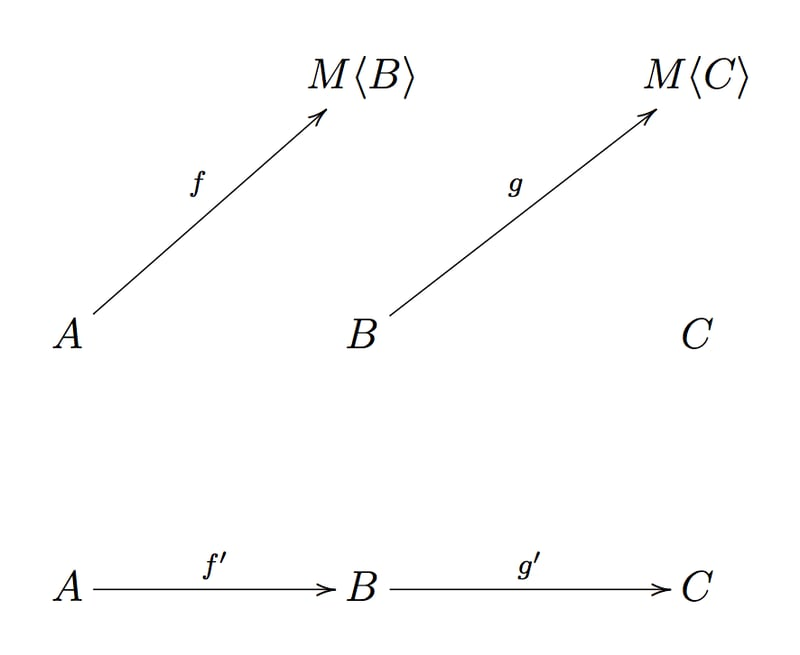
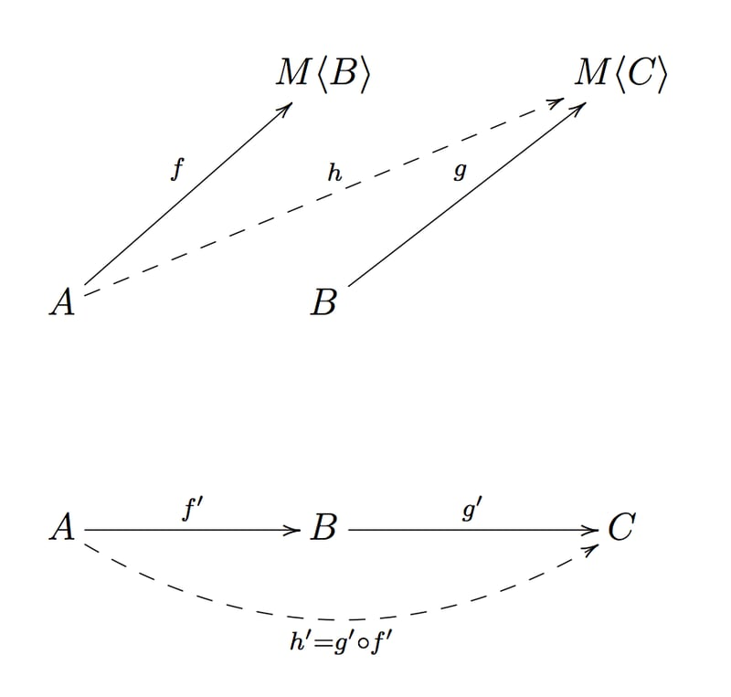

在上一章我们了解到:
如果类型构造器`M`支持应用函子实例(Applicative Functor Instance)
那么我们可以通过`lift` n元函数`g`,将有副作用的`g`和`M`组合使用


|  f	 |  g	 | 组合 |
| ------------- | ------------- | ------------- |
| pure | pure | `g ∘ f` |
| effectul | pure(nary) | `liftAg(g) ∘ f` |

考虑一下如果两个函数都是有副作用的应该如何解决呢

```typescript
f: (a: A) => M<B>
g: (b: B) => M<C>
```

在这种情况下,什么才是`f`和`g`的组合呢


为了处理这种嵌套上下文的情况，我们需要比 函子（Functor） 更强大的抽象，因为单纯使用函子很容易导致上下文嵌套

# 嵌套上下文(nested context)

我们还是通过例子来更好的了解为什么我们需要更多的抽奖工具去解决这个问题.

## M = Array

以一个`user`用户为例 我们来检索一下关注者的关注者

```typescript
interface User {
  followers: Array<User>
}

const getFollowers = (user: User): Array<User> => user.followers

declare const user: User

const followersOfFollowers: Array<Array<User>> = getFollowers(user).map(getFollowers)
```

这里有一点点问题 `followersOfFollowers`的类型是 `Array<Array<User>>`
但其实我们需要的是 `Array<User>`

我们把嵌套的数组进行折叠or压平(flatten)

这个`flatten`函数我们在`fp-ts`工具库里已经导出了

```typescript
import { flatten } from 'fp-ts/Array'

const followersOfFollowers: Array<User> = flatten(getFollowers(user).map(getFollowers))
```

不错!
那么对于其他的数据结构呢?

## M = Option

让我们来看看这个求列表头的倒数的计算函数

```typescript
import { Option, some, none, option } from 'fp-ts/Option'
import { head } from 'fp-ts/Array'

const inverse = (n: number): Option<number> => (n === 0 ? none : some(1 / n))

const inverseHead: Option<Option<number>> = option.map(head([1, 2, 3]), inverse)
```

是的,又出现了. `inverseHead`的类型是`Option<Option<number>>`
但是我们要的是`Option<number>`

我们需要压平嵌套的 `Option`

```typescript
import { isNone } from 'fp-ts/Option'

const flatten = <A>(mma: Option<Option<A>>): Option<A> => (isNone(mma) ? none : mma.value)

const inverseHead: Option<number> = flatten(option.map(head([1, 2, 3]), inverse))
```

观察这些压平函数的例子.
这并非巧合，其底层机制正是由 函数式模式（Functional Pattern） 所支撑

事实上所有这些类型构造器,都是 **`单子`的实例**

**压平(fllatan)**正是单子中最特殊的一个.

# 定义

一个单子的定义遵循以下三条法则

1. 类型构造器`M`是一个函子实例
2. 一个函数`of`由以下签名实现
```typescript
of: <A>(a: A) => HKT<M, A>
```
3. 一个函数 `flatMap`由一下签名实现

```typescript

flatMap: <A, B>(f: (a: A) => HKT<M, B>) => ((ma: HKT<M, A>) => HKT<M, B>)

```

注意：`HKT` 类型是 `fp-ts` 中表示泛型类型构造器的方式。因此，当您看到 `HKT<M, X>` 时，可理解为类型构造器 `M` 应用于类型` X` 的结果（即 `M<X>`）

`of` 和 `flatMap` 函数需满足以下三条定律：

1. 左单位元（Left Identity）：
`flatMap(of) ∘ f = f`

2. 右单位元（Right Identity）：
`flatMap(f) ∘ of = f`

3. 结合律 (Associativity)

`flatMap(h) ∘ (flatMap(g) ∘ f) = flatMap((flatMap(h) ∘ g)) ∘ f`

其中 `f` `g` `h` 都是有副作用的函数 `∘` 表示常规的函数组合

> 单子定律是函数式编程中确保复杂副作用操作（如异步、状态管理）可靠组合的数学基础。通过 flatMap 和 of 的约束，开发者可以像搭积木一样安全地组合效应式程序

```typescript
// 左单位元 先注入值再绑定函数，等价于直接应用函数
const f = (x: number) => Promise.resolve(x + 1);  
Promise.resolve(42).then(f) === f(42); // 行为等价  
```

```typescript
// 右单位元 绑定 of 相当于“无操作”
const m = Promise.resolve(42);  
m.then(Promise.resolve) === m; // true  
```

```typescript
// 结合律  链式调用的顺序不影响结果
m.then(f).then(g);  
m.then(x => f(x).then(g)); 
```

```typescript
// 隐藏的flatten 
const nestedPromise: Promise<Promise<number>> = Promise.resolve(Promise.resolve(42));  
const flattened = nestedPromise.then(x => x); // Promise<number>  
```

# 行吧,但是为什么呢?


回想当年,当我第一次看到这样的定义时,我的第一反应是困惑

脑海中不断盘旋着这些问题：

- 为什么偏偏是这两个特定操作？为什么它们的类型长这样？

- 为什么叫`flatMap`?

- 这些定律是有意义？

- 但最重要的是，我的 `flatten`操作在哪里？

本文会尝试逐一回答这些问题。

让我们回到核心问题：如何组合两个 有副作用的函数（又称 Kleisli 箭头）？

等等……我们已经接触过一个完全围绕组合的抽象概念。还记得我关于 范畴（Category） 的讨论吗？

**范畴的本质在于组合**

现在，我们可以将问题转化为范畴论问题：能否找到一个范畴来建模 Kleisli 箭头 的组合


# [Kleisli category](https://ncatlab.org/nlab/show/Kleisli+category)

让我们试着构建一个 `K` ,全部由有副作用的函数组成:

- `对象(object)`和 typescript范畴中的完全一样,就是所有的 typescript `类型(type)`
- `态射(morphisms)`:

    `f: A -> M<B>`

    `g: B -> M<C>`

    `f': A -> B`

    `g': B -> C`



考虑一下组合的情况


`h: A -> M<C>`
`h': A -> C`



既然 `h'`是`A`到`C`的直接态射
那我们需要构造出一个这样签名的函数`A => M<C>`

在`monad`的定义1中,我们知道副作用`M`是函子的实例
所以我们可以提升`g: B => M<C>`
得到
`lift(g) : M<B> => M<M<C>`

观察可以发现,我们只需要把 `M<M<C>>` 进行压平,得到`M<C>`就能达成最终目标了


综合以上操作我们得到了 `h => flattan ∘ map(g) ∘ f`

等等 `flattan∘map`不就是`flatMap`嘛

化简一下 `h =>  flatMap(g) ∘ f`

所以现在我们可以更新我们的组合表了

|  f	 |  g	 | 组合 |
| ------------- | ------------- | ------------- |
| pure | pure | `g ∘ f` |
| effectul | pure(nary) | `liftAg(g) ∘ f` |
| effectul | effectful | `flatMap(g) ∘ f` |

`of`就是`K`中的恒等态射
在`K`中,对于每个对象类型的`A`的恒等态射`1A: A => M<A>`
```typescript
const identityKleisli = (a: A): M<A> => of(a);  
```

实例演示
```typescript
// 恒等态射：A → M<A>  
const of = <A>(a: A): Promise<A> => Promise.resolve(a);  

// 验证恒等律  
const fetchUser = (id: number): Promise<User> => { ... };  

// 左单位元  
const leftId = (id: number) =>  
  of(id).then(fetchUser); // 等价于 fetchUser(id)  

// 右单位元  
const rightId = (userPromise: Promise<User>) =>  
  userPromise.then(of); // 等价于 userPromise  

```

实例
```typescript
// 定义单子的 flatMap 和 of  
const flatMap = <A, B>(ma: Promise<A>, f: (a: A) => Promise<B>): Promise<B> =>  
  ma.then(f);  

const of = <T>(x: T): Promise<T> => Promise.resolve(x);  

// Kleisli 箭头  
const fetchUser = (id: number): Promise<User> => { ... };  
const fetchPosts = (user: User): Promise<Post[]> => { ... };  

// 组合为 Kleisli 范畴的态射  
const fetchUserPosts = (id: number): Promise<Post[]> =>  
  flatMap(fetchUser(id), user => fetchPosts(user));  
```

这样我们就可以把`K`中的变换映射到`TS`

|  性质	 |  K	 | TS |
| ------------- | ------------- | ------------- |
|  左单位元	 |  1B ∘ f' = f'	 | flatMap(of) ∘ f = f |
|  右单位元	 |  f' ∘ 1A = f'	 | flatMap(f) ∘ of = f |
|  结合律	 |  h' ∘ (g' ∘ f') = (h' ∘ g') ∘ f'	 | flatMap(h) ∘ (flatMap(g) ∘ f) = flatMap((flatMap(h) ∘ g)) ∘ f |

# `FP-TS`中的单子

在`fp-ts`中 `flatMap`被重新转换成了一个函数`chain`

```typescript
flatMap: <A, B>(f: (a: A) => HKT<M, B>) => ((ma: HKT<M, A>) => HKT<M, B>)
chain:   <A, B>(ma: HKT<M, A>, f: (a: A) => HKT<M, B>) => HKT<M, B>
```

`chain`可以由`flatMap`推导出来

所以回到我们一开始的例子
我们就可以用`chain`解决上下文嵌套的问题

```typescript
import { array, head } from 'fp-ts/Array'
import { Option, option } from 'fp-ts/Option'

const followersOfFollowers: Array<User> = array.chain(getFollowers(user), getFollowers)

const headInverse: Option<number> = option.chain(head([1, 2, 3]), inverse)
```

# 总结

函数式编程提供了许多通用的方法用来解决带副作用的函数的组合问题
比如 函子,应用函子,单子,他们都是用来组合不同函数的抽象工具  
