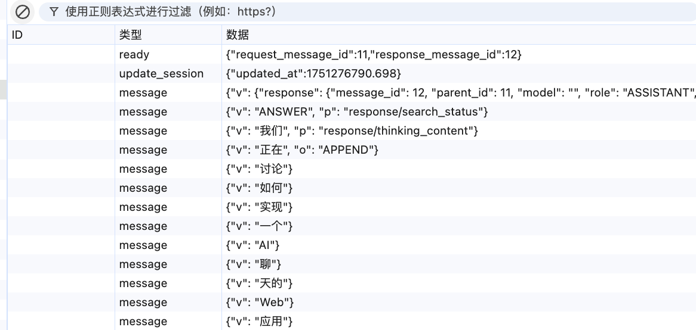
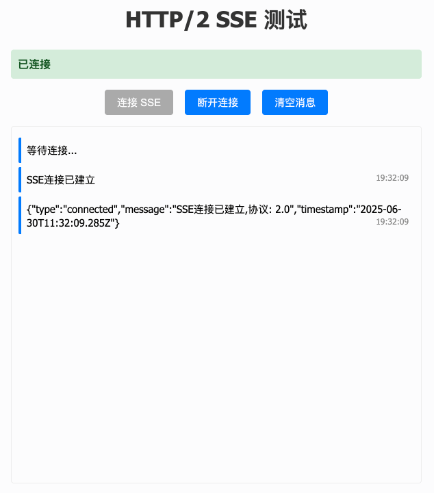

# SSE (Server-Sent Events)

## 引子

去`DeepSeek`的聊天页面询问他的流式聊天是怎么实现的

`AI`会告诉你使用了`SSE`技术实现

打开调试面板可以看到访问的是`/api/v0/chat/completion`

响应标头:

```json
{
  "access-control-allow-credentials": "true",
  "content-type": "text/event-stream; charset=utf-8",
  "date": "Mon, 30 Jun 2025 11:00:54 GMT",
  "server": "CW",
  "strict-transport-security": "max-age=31536000; includeSubDomains; preload",
  "x-content-type-options": "nosniff",
  "x-ds-served-by": "chat"
}
```



可以看到只发了一次请求,后续内容全部由服务器推送

1. 确认`ready`之后进行了`update_session`更新票据
2. 同步本地的配置,比如`AI`的工作模式,一些上下文相关的`id`等
3. 确认传递流式传输正文,会指定对应的包裹格式,例如`p:response:thinking_content`
4. 直到服务器确定内容已经传输完成,在`finish`之后`close`关闭连接

## 基础概念

**SSE (Server-Sent Events)** 是一种[Web 标准](https://developer.mozilla.org/zh-CN/docs/Web/API/EventSource)，允许服务器向客户端推送实时数据。

### 特性和对比

- **单向通信**：只能从服务器向客户端发送数据
- **基于 HTTP**：使用标准的 HTTP 连接
- **自动重连**：浏览器会自动处理连接断开和重连
- **简单易用**：比 WebSocket 更容易实现

| 特性           | 轮询 (Polling)       | SSE (Server-Sent Events) | WebSocket        |
| -------------- | -------------------- | ------------------------ | ---------------- |
| **通信方向**   | 双向                 | 单向（服务器 → 客户端）  | 双向             |
| **协议**       | HTTP                 | HTTP                     | WebSocket        |
| **连接方式**   | 短连接               | 长连接                   | 长连接           |
| **实时性**     | 低（取决于轮询间隔） | 高                       | 最高             |
| **服务器负载** | 高（频繁请求）       | 低                       | 低               |
| **客户端负载** | 低                   | 低                       | 低               |
| **实现复杂度** | 简单                 | 简单                     | 中等             |
| **浏览器支持** | 所有浏览器           | 现代浏览器               | 现代浏览器       |
| **数据格式**   | JSON                 | 文本流                   | 二进制/文本      |
| **适用场景**   | 低频更新             | 实时通知、数据推送       | 实时聊天、游戏   |
| **带宽消耗**   | 高（请求头开销）     | 低                       | 最低             |
| **安全性**     | 标准 HTTP 安全       | 标准 HTTP 安全           | 需要额外安全措施 |

## 服务端示例

### 1.设置响应头

```typescript
ctx.set({
  "Content-Type": "text/event-stream; charset=utf-8",
  "Cache-Control": "no-cache",
  Connection: "keep-alive",
  "Access-Control-Allow-Origin": "*",
});
```

比较关键的是

1. `text/event-stream`
   浏览器会读这个请求头进行流式响应
2. `keep-alive`
   没有设置长连接的话,会请求一次直接关闭

紧接着需要

```typescript
// 首次连接时 返回200表示响应成功
ctx.status = 200;
//避免koa自动结束响应
ctx.respond = false;
```

### 2. 返回流

`koa`原理里讲了`response`可以作为一个流返回

在`response`上提供了一个`write`方法方便我们快速写内容

```typescript
const connectMessage = {
  type: "connected",
  message: `SSE连接已建立,协议: ${ctx.req.httpVersion}`,
  timestamp: new Date().toISOString(),
};
ctx.res.write(`data: ${JSON.stringify(connectMessage)}\n\n`);
```

每次发送的数据由多个`message`组成,每个`message`以`\n\n`表示结束

每个`message`由多个`row`组成,每个`row`以`\n`表示结束

`row`表达式:

```bash
# 注释字段
: 这是注释\n
# 数据字段（必需）
data: 消息内容\n
# 事件类型字段（可选）
# 可以指定自定义的监听事件
# 默认是 message 使用addEventListener监听
event: 事件类型\n
# ID字段（可选）用于重连时恢复进度
# 重连会带在`Last-Event-ID`请求头里
id: 事件ID\n
# 重试时间字段（可选）
retry: 重连间隔毫秒数\n
```

设置一个定时器模拟`AI`的回复,就可以完成内容的转写了

写完之后`close`断开连接服务端的操作就完毕了

```typescript
let messageCount = 0;
const timer = setInterval(() => {
  try {
    messageCount++;
    const data = {
      type: "content",
      msg: dingFengBo[messageCount - 1] || "诗词已结束",
      time: new Date().toISOString(),
      messageCount,
      author: "苏轼",
      title: "定风波·莫听穿林打叶声",
    };
    ctx.res.write(`data: ${JSON.stringify(data)}\n\n`);

    if (messageCount >= 4) {
      const endMessage = {
        type: "end",
        message: "苏轼《定风波》推送完毕",
        timestamp: new Date().toISOString(),
        totalMessages: messageCount,
      };
      ctx.res.write(`data: ${JSON.stringify(endMessage)}\n\n`);
      clearInterval(timer);
      ctx.res.end();
    }
  } catch (error) {
    clearInterval(timer);
  }
}, 1000); // 每1秒推送一句

ctx.req.on("close", () => {
  clearInterval(timer);
});
```

## 客户端示例

新建一个`EventSource`对象,参数传`url`

监听`onopen`,`onmessage`,`onerror`事件,然后更新页面内容

```typescript
function connectSSE() {
  if (eventSource) return;
  updateStatus("connecting", "正在连接...");
  eventSource = new EventSource("/api/sse");
  eventSource.onopen = function () {
    updateStatus("connected", "已连接");
    document.getElementById("connectBtn").disabled = true;
    document.getElementById("disconnectBtn").disabled = false;
    addMessage("SSE连接已建立");
  };
  eventSource.onmessage = function (e) {
    try {
      addMessage(JSON.parse(e.data));
    } catch {
      addMessage(e.data);
    }
  };
  eventSource.onerror = function () {
    updateStatus("disconnected", "连接断开");
    document.getElementById("connectBtn").disabled = false;
    document.getElementById("disconnectBtn").disabled = true;
    addMessage("SSE连接已断开");
    eventSource.close();
    eventSource = null;
  };
}
```



到这里一个简单的服务器内容推送就完成了

除了`AI Chat`之外,其他单向的内容推送也可以使用这种方式

比如阅读某个文件或者表格,使用流式响应能大大减少等待时间

阅读的时候并不是等完整内容加载之后才开始的,而是在有内容可读的时候开始

## 延伸

`koa`官方的`issue`里也有被采纳的`sse`[中间件](https://github.com/yklykl530/koa-sse)

加入了连接池的机制避免占用

```typescript
const ssePool = [];

let interval = setInterval(() => {
  let ts = +new Date();
  if (ssePool.length > 0) {
    ssePool.forEach((s) => s.send(":"));
    console.log("SSE run ping: for " + ssePool.length + " clients");
  }
}, opts.pingInterval);
```

即使单节点被打满了也可以返回`513`给出更加友好的提示

`SSETransform`类本体从`node:stream`直接进行封装

提供了`send`,`sendEnd`方法 更加易用

`sse` 默认是 `get` 请求 可以修改为`post`

微软提供了[fetch](https://github.com/Azure/fetch-event-source)的封装可以更加灵活的处理
