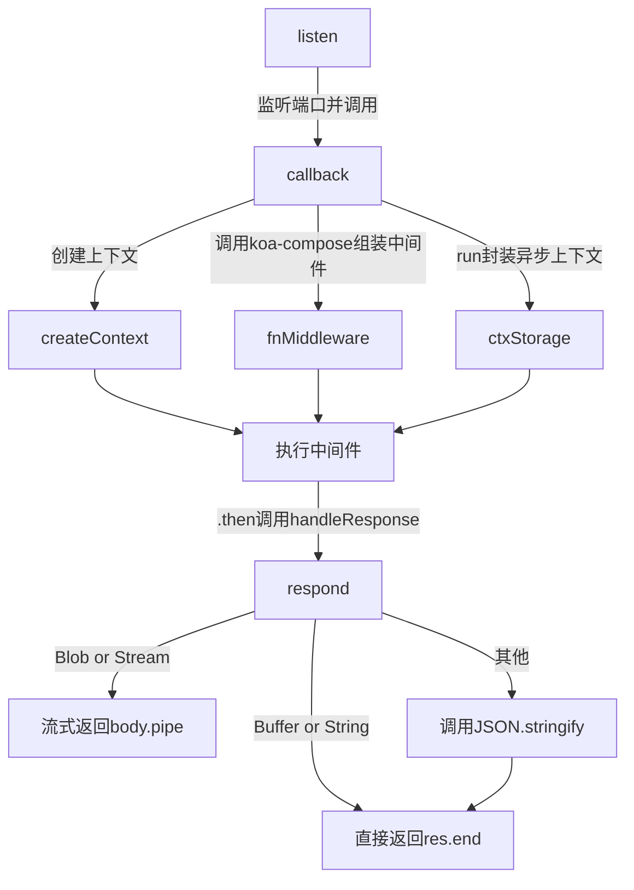

# 模块划分

先看`package.json`,整个包是`commonjs`,入口是`lib/application.js`

依赖库里用`gen-esm-wrapper`提供了`esm`的封装

`dist/koa.mjs` 是很薄的一层

```javascript
import mod from "../lib/application.js";

export default mod;
export const HttpError = mod.HttpError;
```

配套的 `exports` 实现

```json
  "exports": {
    ".": {
      "require": "./lib/application.js",
      "import": "./dist/koa.mjs",
      "default": "./dist/koa.mjs"
    }}
```

```
lib/
├── application.js    # 应用主类
├── context.js       # 上下文对象
├── request.js       # 请求对象
├── response.js      # 响应对象
├── is-stream.js     # isStream 一个判断方法
├── only.js          # 类似lodash的pick方法
└── search-params.js # 调用URLSearchParams从url里拿参数
```

# Applicantion

构造函数(删除了一些配置项的初始化赋值)

```javascript
  constructor (options) {
    super()
    options = options || {}
    this.compose = options.compose || compose
    this.middleware = []
    this.context = Object.create(context)
    this.request = Object.create(request)
    this.response = Object.create(response)
    if (options.asyncLocalStorage) {
      if (options.asyncLocalStorage instanceof AsyncLocalStorage) {
        this.ctxStorage = options.asyncLocalStorage
      } else {
        this.ctxStorage = new AsyncLocalStorage()
      }
    }
  }
```

这里基本上串起了整个 `koa` 的运作方式

- `compose` 是基于[koa-compose](https://github.com/koajs/compose)实现的
- `middleware` 是我们使用`app.use(...)`挂载中间件的地方
- 新建`request`,`response`对象用来处理请求上下文和响应上下文,`context`是对上下文进行的封装
- `ctxStorage`基于[AsyncLocalStorage](https://nodejs.org/docs/v22.16.0/api/async_context.html#cl
  ass-asynclocalstorage)做的封装,可以让我们不必在所有工具函数上都添加`ctx`入参用来获得上下文

## listen

`http` 模块的语法糖

```javascript
  listen (...args) {
    debug('listen')
    const server = http.createServer(this.callback())
    return server.listen(...args)
  }
```

单个实例可以绑定多个端口,支持不同的协议

```javascript
const http = require("http");
const https = require("https");
const Koa = require("koa");
const app = new Koa();
http.createServer(app.callback()).listen(3000);
https.createServer(app.callback()).listen(3001);
```

侦听到请求后调用`app.callback()`

## callback

做三件事情

1. `createContext`接收`node:http`的`req`和`res`作为参数创建上下文,`createContext`主要是做一些上下文绑定的工作,不展开了
2. 使用`ctxStorage.run`创建一个新的异步上下文,保证回调函数`this.handleRequest`在其所有异步操作中都能访问到正确的`ctx`
3. 中间件使用`koa-compose`封装后传给`handleRequest`依次调用

```javascript
  callback () {
    const fn = this.compose(this.middleware)

    const handleRequest = (req, res) => {
      const ctx = this.createContext(req, res)
      return this.ctxStorage.run(ctx, async () => {
        return await this.handleRequest(ctx, fn)
      })
    }

    return handleRequest
  }
```

## handleRequest

`onFinished`是`on-finished`库的封装

给 `Stream` 流封装一个结束的回调

当响应结束时（无论成功还是失败），都会触发 `onerror` 回调

在完成中间件的调用后,在`.then`里执行`handleResponse`

也就是说路由,甚至业务逻辑处理本身在框架层面看都是一个中间件

执行的是根据请求去修改`ctx`的逻辑

```javascript
  handleRequest (ctx, fnMiddleware) {
    const res = ctx.res
    res.statusCode = 404
    const onerror = (err) => ctx.onerror(err)
    const handleResponse = () => respond(ctx)
    onFinished(res, onerror)
    return fnMiddleware(ctx).then(handleResponse).catch(onerror)
  }
```

### respond

源码里删掉了处理一些空的边界状态的情况
等待所有中间件执行完之后会被调用,用来处理返回值

- 如果是`string`或者`Buffer`会直接返回`res.end(body)`
- 如果是各种流会流式返回`body.pipe(res)`
- 剩下的情况会用`JSON.stringify(body)`以字符串的形式返回

```javascript
function respond(ctx) {
  let body = ctx.body;
  // responses
  if (Buffer.isBuffer(body)) return res.end(body);
  if (typeof body === "string") return res.end(body);
  if (body instanceof Blob) {
    return Stream.Readable.from(body.stream()).pipe(res);
  }
  if (body instanceof ReadableStream) {
    return Stream.Readable.from(body).pipe(res);
  }
  if (body instanceof Response) {
    return Stream.Readable.from(body?.body || "").pipe(res);
  }
  if (isStream(body)) return body.pipe(res);

  // body: json
  body = JSON.stringify(body);
  if (!res.headersSent) {
    ctx.length = Buffer.byteLength(body);
  }
  res.end(body);
}
```

## 小结



# Context

当前实现是非常薄的一层

`BaseContext`封装了错误处理层,剩余部分都是通过代理来实现的

```typescript
interface ExtendableContext extends BaseContext {
  app: Application;
  request: Request;
  response: Response;
  req: IncomingMessage;
  res: ServerResponse;
  originalUrl: string;
  cookies: Cookies;
  accept: accepts.Accepts;
  respond?: boolean | undefined;
}
```

在`Context`封装了 `cookie` 的处理

```javascript
  get cookies () {
    if (!this[COOKIES]) {
      this[COOKIES] = new Cookies(this.req, this.res, {
        keys: this.app.keys,
        secure: this.request.secure
      })
    }
    return this[COOKIES]
  },

  set cookies (_cookies) {
    this[COOKIES] = _cookies
  }
```

代理部分是通过一个名为[委托(delegate)](https://github.com/zenorocha/delegate)的库实现的

通过`delegate`包裹一个对象把原型的属性和方法挂载到委托对象上

```javascript
function Delegator(proto, target) {
  if (!(this instanceof Delegator)) return new Delegator(proto, target);
  this.proto = proto;
  this.target = target;
  this.methods = [];
  this.getters = [];
  this.setters = [];
  this.fluents = [];
}
```

像这样使用,把`request`里的属性挂载到`Context`对象上

```javascript
delegate(proto, "request")
  .method("acceptsLanguages")
  .method("accepts")
  .access("method")
  .getter("ip");
```

# Request&Response

用来处理上下文相关的属性,查阅文档即可

列几个平时了解不多的方法

## request-ip

比如`x-forward-for`会记录代理的地址,对于排查请求的链路(负载均衡/CDN)有一定的作用,但是可以被伪造

通常取的`ip`属性就是`ips`的第一个值,兜底使用`socket.remoteAddress`

```javascript
  get ips () {
    const proxy = this.app.proxy
    const val = this.get(this.app.proxyIpHeader)
    let ips = proxy && val
      ? splitCommaSeparatedValues(val)
      : []
    if (this.app.maxIpsCount > 0) {
      ips = ips.slice(-this.app.maxIpsCount)
    }
    return ips
  },
  get ip () {
    if (!this[IP]) {
      this[IP] = this.ips[0] || this.socket.remoteAddress || ''
    }
    return this[IP]
  },
```

## request-fresh

这里会对协商缓存进行响应,决定是否返回 `304`

```javascript
  get fresh () {
    const method = this.method
    const s = this.ctx.status

    // GET or HEAD for weak freshness validation only
    if (method !== 'GET' && method !== 'HEAD') return false

    // 2xx or 304 as per rfc2616 14.26
    if ((s >= 200 && s < 300) || s === 304) {
      return fresh(this.header, this.response.header)
    }

    return false
  },
```

# 中间件实现

`Koa-compose`只有一个文件

```javascript
function compose(middleware) {
  if (!Array.isArray(middleware))
    throw new TypeError("Middleware stack must be an array!");
  for (const fn of middleware) {
    if (typeof fn !== "function")
      throw new TypeError("Middleware must be composed of functions!");
  }

  /**
   * @param {Object} context
   * @return {Promise}
   * @api public
   */

  return function (context, next) {
    // last called middleware #
    let index = -1;
    return dispatch(0);
    function dispatch(i) {
      if (i <= index)
        return Promise.reject(new Error("next() called multiple times"));
      index = i;
      let fn = middleware[i];
      if (i === middleware.length) fn = next;
      if (!fn) return Promise.resolve();
      try {
        return Promise.resolve(fn(context, dispatch.bind(null, i + 1)));
      } catch (err) {
        return Promise.reject(err);
      }
    }
  };
}
```

接收一个函数数组,返回一个`Promise`

核心是这里

```typescript
Promise.resolve(fn(context, dispatch.bind(null, i + 1)));
```

执行当前中间件，传入 `context` 和 `next` 函数

`next` 函数是 `dispatch.bind(null, i + 1)`用于执行下一个中间件

```javascript
app.use(async (ctx, next) => {
  console.log("Middleware 1");
  await next(); // 调用 dispatch 执行下一个中间件
  console.log("Middleware 1 after");
});

app.use(async (ctx, next) => {
  console.log("Middleware 2");
  await next();
  console.log("Middleware 2 after");
});
```
