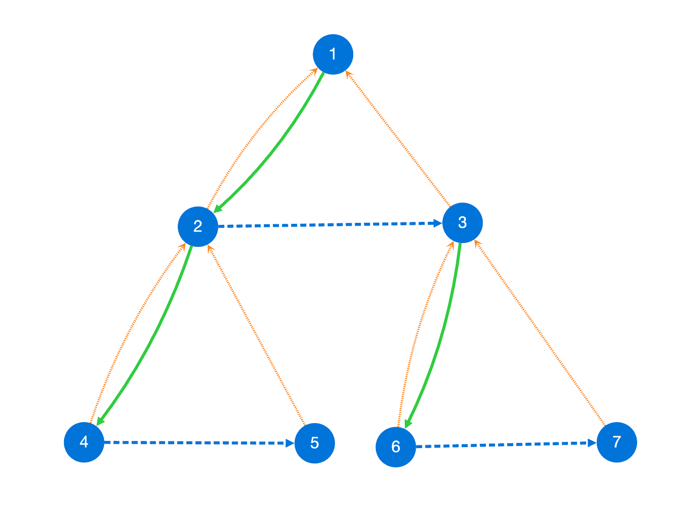
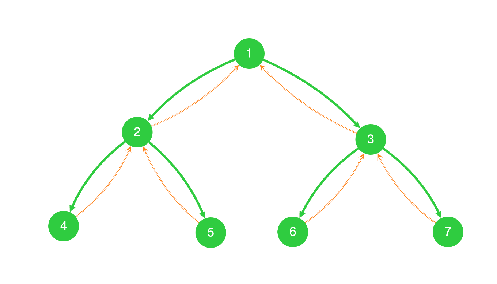
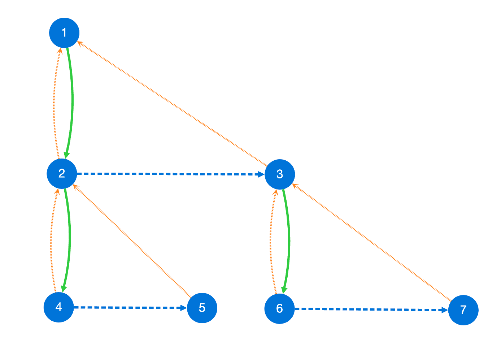

# 引子

> 问题: 如何把一棵树变成一个链表

一个简单的想法是,使用某种遍历方式

遍历树中的每个节点,然后调整节点的连接方式即可完成

转换成链表之后,我们不再能直观表达树形结构

如果需要同时表达节点的父子关系和兄弟关系

可以依赖一种特殊的数据结构来实现

# Fiber 节点

`Fiber` 节点通过三个核心指针来模拟一个完整的树形结构,并同时定义了遍历顺序

```typescript
class FiberNode<T> {
  value: T;
  parent: FiberNode<T> | null = null;
  sibling: FiberNode<T> | null = null;
  child: FiberNode<T> | null = null;
  constructor(value: T, parent: FiberNode<T> | null) {
    this.value = value;
    if (parent) this.parent = parent;
  }
}
```

- `child`: 指向它的第一个子节点
- `sibling`: 指向它的下一个兄弟节点
- `parent`: 指向它的父节点

在遍历时可以

- 通过`child`向下进入子树
- 通过 `sibling` 横向遍历兄弟节点
- 通过 `parent` 向上返回

这种设计使得树的递归遍历可以被分解成一个可以随时暂停和恢复的线性结构

```typescript
/**
 * @description 遍历Fiber树
 */
function* traverseFiberTreeNode<T>(
  fiberTree: FiberNode<T> | null
): Generator<FiberNode<T>> {
  let current = fiberTree;
  while (current) {
    yield current;
    if (current.child) {
      // 有子节点 访问子节点
      current = current.child;
    } else if (current.sibling) {
      // 有兄弟节点 访问兄弟节点
      current = current.sibling;
    } else {
      /**
       * 既没有子节点,也没有兄弟节点 向上返回
       * 因为自身是父节点的最后一个节点
       * 意味着父节点的所有子节点在返回时都遍历了
       * 同时父节点也被访问过 故而直接访问父节点的兄弟节点
       * 如果父节点也是最后一个节点 返回null继续向上返回
       */
      current = current.parent?.sibling || null;
    }
  }
}
```

# Fiber 树的构建

是的,上述遍历方式就是深度优先搜索
在递归过程中维护节点结构就可以了

## 二叉树构建

```typescript
function buildFiberTreeFromBinaryTree<T>(
  binaryNode: BinaryTreeNode<T> | null,
  parentFiberNode: FiberNode<T> | null
): FiberNode<T> | null {
  // 如果二叉树节点为空,则返回 null
  if (!binaryNode) return null;

  // 创建当前 Fiber 节点并链接父节点
  const currentFiberNode = new FiberNode<T>(binaryNode.value, parentFiberNode);

  // 递归构建左、右子树的 Fiber 节点
  const leftChildFiber = buildFiberTreeFromBinaryTree(
    binaryNode.left,
    currentFiberNode
  );
  const rightChildFiber = buildFiberTreeFromBinaryTree(
    binaryNode.right,
    currentFiberNode
  );

  // 第一个子节点作为 child 其余子节点作为 child 的兄弟节点
  currentFiberNode.child = leftChildFiber;
  if (leftChildFiber) {
    leftChildFiber.sibling = rightChildFiber;
  } else {
    currentFiberNode.child = rightChildFiber;
  }

  // 返回当前 Fiber 节点
  return currentFiberNode;
}
```

## 多叉树构建

```typescript
function buildFiberTreeFromTreeNode<T>(
  treeNode: TreeNode<T>,
  parentFiberNode: FiberNode<T> | null
): FiberNode<T> {
  // 创建当前 Fiber 节点并链接父节点
  const currentFiberNode = new FiberNode<T>(treeNode.value, parentFiberNode);

  // 遍历所有子节点
  if (treeNode.children && treeNode.children.length > 0) {
    let previousSibling: FiberNode<T> | null = null;
    for (let i = 0; i < treeNode.children.length; i++) {
      const childTreeNode = treeNode.children[i];
      // 递归构建 Fiber 节点
      const childFiberNode = buildFiberTreeFromTreeNode(
        childTreeNode,
        currentFiberNode
      );
      //第一个子节点作为child
      if (i === 0) {
        currentFiberNode.child = childFiberNode;
      } else if (previousSibling) {
        // 其余子节点作为 child 的兄弟节点F
        previousSibling.sibling = childFiberNode;
      }
      previousSibling = childFiberNode;
    }
  }

  // 返回当前 Fiber 节点
  return currentFiberNode;
}
```

## Fiber 树实例

```typescript
class FiberTree<T> {
  root: FiberNode<T> | null = null;

  constructor(tree: BinaryTree<T> | TreeNode<T> | null) {
    if (tree instanceof BinaryTree) {
      this.root = buildFiberTreeFromBinaryTree(tree.root, null);
    } else if (tree instanceof TreeNode) {
      this.root = buildFiberTreeFromTreeNode(tree, null);
    } else {
      this.root = null;
    }
  }

  [Symbol.iterator](): Iterator<T> {
    return traverseFiberTree(this.root);
  }
}
```

# Fiber 树可视化

使用[cytoscape](https://js.cytoscape.org/)来绘制节点

定义好输出的结构

```typescript
/** 节点 */
type CyNode = { data: { id: string; label: string } };
/** 边 */
type CyEdge = {
  data: {
    source: string;
    target: string;
    edgeType: "child" | "parent" | "sibling";
  };
};
```

直接使用 `traverseFiberTreeNode` 遍历两次

第一次生成所有节点,第二次绘制边即可

```typescript
function fiberTreeToCytoscapeData(root: FiberNode<any> | null) {
  const nodes: CyNode[] = [];
  const edges: CyEdge[] = [];
  let id = 0;
  const nodeMap = new Map<FiberNode<any>, string>();

  // 第一次遍历：收集所有节点
  for (const node of traverseFiberTreeNode(root)) {
    let nodeId = nodeMap.get(node);
    if (!nodeId) {
      nodeId = String(node.value) + "_" + id++;
      nodeMap.set(node, nodeId);
      nodes.push({ data: { id: nodeId, label: String(node.value) } });
    }
  }
  // 第二次遍历：收集所有边
  for (const node of traverseFiberTreeNode(root)) {
    const nodeId = nodeMap.get(node)!;
    // parent 边（箭头应从子指向父）
    if (node.parent) {
      const parentId = nodeMap.get(node.parent)!;
      edges.push({
        data: { source: nodeId, target: parentId, edgeType: "parent" },
      });
    }
    // child 边
    if (node.child) {
      const childId = nodeMap.get(node.child)!;
      edges.push({
        data: { source: nodeId, target: childId, edgeType: "child" },
      });
    }
    // sibling 边
    if (node.sibling) {
      const siblingId = nodeMap.get(node.sibling)!;
      edges.push({
        data: { source: nodeId, target: siblingId, edgeType: "sibling" },
      });
    }
  }
  return { nodes, edges };
}
```

```typescript
const edgeColors = {
  child: "#2ECC40", // 绿色连接子节点
  parent: "#FF851B", // 橙色连接父节点
  sibling: "#0074D9", // 蓝色连接兄弟节点
};
```



可以和二叉树直观对比,加深对`DFS`的理解



# DFS 再思考

假设你是拿着绣春刀的锦衣卫

Judy 给你的最高指示是把方某的后代满门抄斩

为了避免留下后患,你决定使用深度优先搜索**(Depth-First Search)**坚决的执行

## 递

深度优先的核心思想:**一条路走到黑**

1. 杀掉方某本人
2. 杀掉方某的长子
3. 杀掉方某的长孙
   ...

想象你拿着大砍刀站在扇形的菜市口

沿着一个方向杀到杀无可杀为止

杀到独苗(叶子节点)彻底断绝才停下来

> 作为对比 在选择行刑对象方面,广度优先搜索倾向于先杀站在前面的 就像从馅儿开始吃披萨饼一样

## 归

长子一脉已经屠戮殆尽,看看他还有没有次子

灭门长子一脉之后,次子就变成了新的长子

退一步转个身子自然就有人站到面前来

很好,立刻奔赴次子府上,沿用递的方法,将次子府上也一网打尽

当一个节点所有后代都被处决完毕

我们就重新回到他的父节点,寻找下一个还没处理的兄弟节点

这个过程被称为回溯(Backtracking)

## 总结

对 Fiber 树进行拓扑变形



结合变形的 Fiber 图再回顾`traverseFiberTreeNode`

遍历策略简单归结如下

- 向下直到无法向下为止
- 向右直到无法向右为止
- 向上返回,因为我们是从下面上去的,所以直接向右

## 应用

我自己是因为`React`的新架构了解 Fiber 树

深度优先搜索的思想在很多地方都有体现：

- **文件系统搜索**：当你在电脑上搜索一个文件时,系统可能会先进入第一个文件夹,把它里面的所有子文件夹和文件都检查完,然后再退出来,去检查第二个文件夹
- **网络爬虫**：部分网络爬虫会从一个网页开始,点击页面上的第一个链接,然后进入新页面,再点击新页面上的第一个链接 直到没有新链接可点,才返回上一页,点击第二个链接
- **AI 游戏**：在棋类游戏的策略执行中,计算机会思考一步棋,然后沿着这步棋推演下去,看看后续几步会发生什么（深入探索）,如果发现局势不利（死胡同）,就退回来,尝试其他的走法
