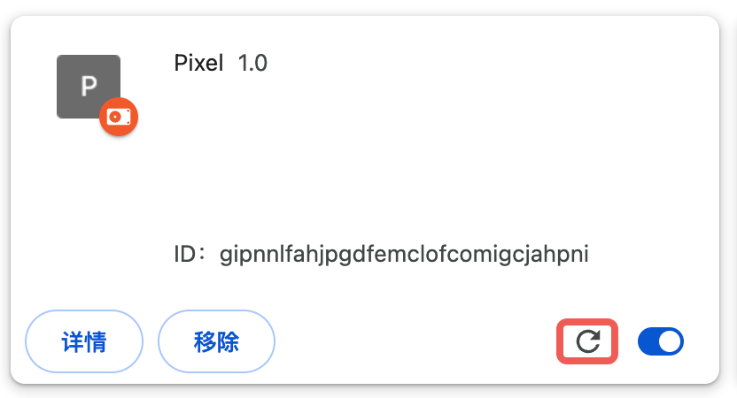

[Chrome 官方教程](https://developer.chrome.google.cn/docs/extensions/get-started)

# 最小模块

新建一个`manifest.json`文件

这是插件的入口描述文件

添加如下内容

```json
{
  "name": "Pixel",
  "version": "1.0",
  "manifest_version": 3,
  "action": {
    "default_popup": "index.html",
    "default_icon": "icon.png"
  }
}
```

注意挂载好的`index.html`和`icon.png`

`Chrome`浏览器输入`chrome://extensions`

选择开发者模式,选中`加载未打包的应用程序`

选中当前工程目录的地址即可



修改代码后点击红框中的刷新按钮即可重新加载最新的内容

# 功能介绍

## [action](https://developer.chrome.com/docs/extensions/reference/api/action)

指定插件的入口交互

可以通过`default_icon`指定插件的图标类型

可以通过`default_title`指定悬停图标展示的内容

可以通过`default_popup`挂载一个网页来做弹窗或者菜单栏的交互

可以通过设置徽章`action.setBadgeBackgroundColor/setBadgeText`

来直观的在入口做一些插件提示,展示插件当前的状态

## [sidePanel](https://developer.chrome.com/docs/extensions/reference/api/sidePanel)

- 借助`Side Panel`扩展程序可以在侧边栏中显示自己的界面

- 在标签页之间导航时,侧边栏会保持打开状态 (也可以监听在特定网站上显隐或者指定唤醒方式)

- 作为扩展程序页面，侧边栏可以访问所有 Chrome API

## [permissions](https://developer.chrome.com/docs/extensions/reference/api/permissions)

指定插件可用的权限范围

当前用到了`sidePanel`,只需要注明`sidePanel`即可

此时用其他越过权限的`chrome API`会报错

比如插件想要对生成出来的内容做持久化保存,就要增加`storage`的权限

## [storage](https://developer.chrome.com/docs/extensions/reference/api/storage)

`Storage` 提供了一种扩展程序专用的方法来保留用户数据和状态

1. 在扩展程序上下文都可以访问对应的`Storage`
2. 异步,支持批量读写
3. 即使用户清楚浏览器记录,扩展程序的储存也会被保留
4. 拓展程序的`ServiceWorker`是不能读`WebStorage`的

拓展程序存储空间分为四个区域

1. local

- 会在用户卸载扩展程序时清除
- 默认 10MB,可以通过配置`unlimitedStorage`来获得更多空间

2. session

- 存储在内存中的会话空间 上限 10MB
- 停用/重新加载/更新/浏览器重启都会清除数据

3. sync

- 系统会将数据同步到用户已登录的任何 `Chrome` 浏览器
- 一般用来存储通用配置(主题,核心配置) 上限配额 100kb

4. managed

- 由系统管理员而非用户进行配置的只读存储空间
- 可为组织中的所有用户预配置扩展程序

## content

## [Service Worker](https://developer.chrome.com/docs/extensions/develop/concepts/service-workers)

浏览器拓展提供的功能比标准的[Service Worker](https://developer.mozilla.org/zh-CN/docs/Web/API/Service_Worker_API)适用范围要更广一点

### 核心特性:异步线程

非主线程,不阻塞

因为是独立的,所以带来了一些其他的限制

### 不能直接访问`DOM`

1. `window`对象和`document`对象

   包括修改页面样式布局,获取滚动位置鼠标位置,获取页面标题地址等

2. `alert()`,`confirm()`等交互行为
3. 不能直接操作浏览器的前进后退,历史记录

### 不能使用同步 API

#### XHR

```typescript
self.addEventListener("fetch", (event) => {
  event.respondWith(
    fetch(event.request)
      .then((response) => {
        // 异步处理响应
        return response;
      })
      .catch((error) => {
        console.error("Fetch failed:", error);
        return new Response("Network error", { status: 500 });
      })
  );
});
```

#### Storage

```typescript
// Service Worker 中 - 使用异步存储
self.addEventListener("message", (event) => {
  // 使用 IndexedDB 异步存储
  const dbRequest = indexedDB.open("myDatabase", 1);

  dbRequest.onsuccess = (event) => {
    const db = event.target.result;
    const transaction = db.transaction(["users"], "readonly");
    const store = transaction.objectStore("users");
    const getRequest = store.get("userData");

    getRequest.onsuccess = (event) => {
      const data = event.target.result;
      // 处理数据
      self.postMessage({ type: "data", payload: data });
    };
  };
});

// 或者使用 Chrome Extension Storage API（如果是扩展）
chrome.storage.local.get(["userData"], (result) => {
  const data = result.userData;
  // 处理数据
});
```

#### file

```typescript
// Service Worker 中 - 使用异步文件读取
self.addEventListener("message", (event) => {
  if (event.data.type === "readFile") {
    const file = event.data.file;
    const reader = new FileReader();

    reader.onload = function (e) {
      const content = e.target.result;
      // 异步处理文件内容
      self.postMessage({ type: "fileContent", content });
    };

    reader.readAsText(file, "UTF-8");
  }
});
```

#### 同步配置实例

```typescript
// Service Worker 中
self.addEventListener("install", (event) => {
  event.waitUntil(
    // 异步处理安装过程
    Promise.all([
      // 异步打开缓存
      caches.open("v1").then((cache) => {
        return cache.addAll(["/app.js", "/style.css"]);
      }),

      // 异步获取配置
      new Promise((resolve) => {
        // 通过 postMessage 向主线程请求配置
        self.postMessage({ type: "getConfig" });

        self.addEventListener("message", function handler(event) {
          if (event.data.type === "configResponse") {
            self.removeEventListener("message", handler);
            resolve(event.data.config);
          }
        });
      }),
    ])
  );
});
```

### 信息同步

通过 `postMessage` 与主线程通信：让主线程执行受限操作

最小实现

```typescript
// Service Worker
// 监听来自主线程的消息
self.addEventListener("message", (event) => {
  console.log("Service Worker 收到消息:", event.data);

  // 发送响应回主线程
  self.postMessage({
    type: "response",
    message: "Hello from Service Worker!",
    receivedData: event.data,
  });
});

// 安装事件
self.addEventListener("install", (event) => {
  console.log("Service Worker 已安装");
});

// 激活事件
self.addEventListener("activate", (event) => {
  console.log("Service Worker 已激活");
});
```

```typescript
// Main.js
// 注册 Service Worker
if ("serviceWorker" in navigator) {
  navigator.serviceWorker
    .register("/sw.js")
    .then((registration) => {
      console.log("Service Worker 注册成功:", registration);

      // 监听 Service Worker 的消息
      navigator.serviceWorker.addEventListener("message", (event) => {
        console.log("主线程收到消息:", event.data);
      });

      // 发送消息给 Service Worker
      navigator.serviceWorker.controller.postMessage({
        type: "hello",
        message: "Hello from main thread!",
        timestamp: Date.now(),
      });
    })
    .catch((error) => {
      console.error("Service Worker 注册失败:", error);
    });
}
```

### 安全限制

只能使用 `HTTPS`,受到同源约束

### 使用

在 `manifest.json` 文件的 `background` 字段中指定`Service Worker`

可以通过指定`type`为`module`使用`import`语句

## [Context Script](https://developer.chrome.com/docs/extensions/develop/concepts/content-scripts)

内容脚本,类似于匹配地址然后插入对应页面环境的自执行脚本

常见用途:

- 内容注入:在原网页基础上提供增强功能,比如额外的信息展示,批量操作按钮等

- 内容抓取: 类似爬虫,对第三方源上的内容进行安全的抓取

- 操作脚本: 对于重复执行的操作,通过脚本完成

对应`manifest.json`文件的`content_scripts`

`matches`用来匹配需要执行的地址

`js`用来按顺序注入脚本文件

`css` 可以提供自定义的样式文件

# 实例

这里阅读一下**Obsidian**文档的浏览器剪藏插件[obsidian-clipper](https://github.com/obsidianmd/obsidian-clipper)的源码

插件做了`Chrome`,`firefox`,`Safari`的适配

先看`Chrome`的入口`src/manifest.chrome.json`

`action`对应弹窗页面`popup.html`
`side_panel`对应侧边栏页面`side-panel.html`

两个页面功能是一致的,逻辑落在`src/core/popup.ts`

主逻辑是`handleClipObsidian`函数

完成配置初始化后,搜集内容并格式化,核心逻辑如下:

```typescript
// properties为页面中搜集的剪藏内容
const frontmatter = await generateFrontmatter(properties);
// 保存到笔记软件
await saveToObsidian(
  fileContent,
  noteName,
  path,
  selectedVault,
  currentTemplate.behavior
);
// 更新状态
await incrementStat("addToObsidian", selectedVault, path);
```

`content_scripts` 内容生成的主逻辑在`src/content.ts`

匹配 `http` 协议的地址,提供了`polyfill`向低版本兼容,提供了`highlighter`的样式文件

```json
{
  "content_scripts": [
    {
      "matches": ["http://*/*", "https://*/*"],
      "js": ["browser-polyfill.min.js", "content.js"],
      "css": ["highlighter.css"]
    }
  ]
}
```

`background`对应`background.ts`

```json
{
  "background": {
    "service_worker": "background.js"
  }
}
```

提供了后台一些支持性的功能:

- 插件注册,配置读取和持久化
- 消息的路由和转发 处理复杂的消息传递，协调不同模块间的通信
- 响应各种浏览器事件和用户操作 菜单/快捷键/标签页切换

`commands`配置了默认的快捷键

```json
{
  "commands": {
    "quick_clip": {
      "suggested_key": {
        "default": "Alt+Shift+O",
        "mac": "Alt+Shift+O"
      },
      "description": "__MSG_commandQuickClip__"
    }
  }
}
```
