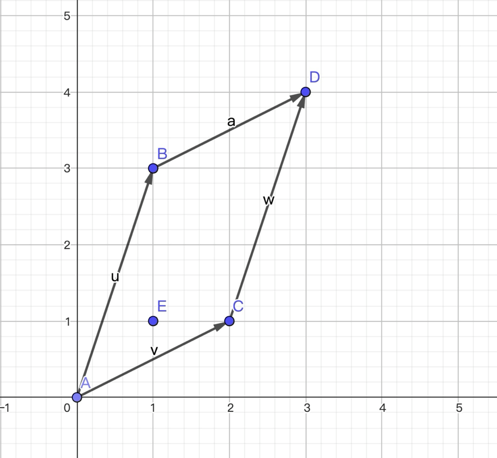

---
tags:
  - 线性代数
  - haskell
---

# 矩阵

矩阵(Matrix)可以看做

1. 列向量构成的一行
2. 行向量构成的一列

用双精度浮点数做标量写出类型定义

```haskell
type Scalar = Double
type Vector = [Scalar]
type Matrix = [Vector] -- type Matrix = [[Scalar]]
```

# 转置

矩阵的转置就是把矩阵的行和列交换

## 实现逻辑

```haskell
转置 m =
    let 取首列 = \m -> map head m
        取余列 = \m -> map tail m
        递归转置 = \m -> if null (head m) then []
                         else 取首列 m : 递归转置 (取余列 m)
    in 递归转置 m
```

- 取首列：使用 `map head` 获取矩阵的每一行的第一个元素，形成第一列
- 取余列：使用 `map tail` 获取矩阵的每一行除第一个元素外的所有元素

递归转置：

- 如果矩阵为空`（null (head m)）`，返回空列表
- 否则，将第一列`（取首列 m）`作为新矩阵的第一行，递归处理剩余列

例如，对于矩阵：

```haskell
[[1, 2, 3],
 [4, 5, 6],
 [7, 8, 9]]
```

1. 第一次递归：
   取首列：`[1, 4, 7]` 成为新矩阵的第一行
   取余列：`[[2, 3], [5, 6], [8, 9]]` 继续递归
2. 第二次递归：
   取首列：`[2, 5, 8]` 成为新矩阵的第二行
   取余列：`[[3], [6], [9]]` 继续递归
3. 第三次递归：
   取首列：`[3, 6, 9]` 成为新矩阵的第三行
   取余列：`[[], [], []]` 为空，递归结束

最终得到转置的矩阵

```haskell
[[1, 4, 7],
 [2, 5, 8],
 [3, 6, 9]]
```

最终的实现

```haskell
转置 :: Matrix -> Matrix
转置 [] = []
转置 ([] : _) = []
转置 m = map head m : 转置 (map tail m)
```

# 计算

> [Haskell 实现](https://github.com/kscarrot/fp/blob/main/haskell/src/Linear.hs)

## 加法

```haskell
标量加 :: Scalar -> Scalar -> Scalar
-- 二元函数标量加就是 (+) 加法操作符本身
标量加 x y = x + y

向量加 :: Vector -> Vector -> Vector
-- 向量加 计算上可以看做对向量中的标量一一对应然后相加
-- 向量加 :: [Scalar] -> [Scalar] -> [Scalar]
-- 向量加 = zipWith 标量加
向量加 = zipWith (+)

矩阵加 :: Matrix -> Matrix -> Matrix
-- 矩阵加 计算上可以看做对矩阵中的向量一一对应然后相加
-- 矩阵加 :: Matrix -> [Vector] -> [Vector]
-- 矩阵加 = zipWith 向量加
-- 矩阵加 = zipWith (zipWith (+))
矩阵加 = zipWith $ zipWith (+)
```

## 乘法

### 标量乘

```haskell
标量乘 :: Scalar -> Scalar -> Scalar
-- 二元函数标量乘就是 * 乘法操作符本身
标量乘 x y = x * y

-- 标量乘向量 满足交换律 对单个方向实现即可
标量乘向量 :: Scalar -> Vector -> Vector
-- 标量乘向量 计算上可以看做对向量中的每个标量进行标量乘
-- 标量乘向量 :: Scalar -> [Scalar] -> [Scalar]
-- 标量乘向量 s = map (标量乘 s)
标量乘向量 = map . (*)

-- 标量乘矩阵
标量乘矩阵 :: Scalar -> Matrix -> Matrix
-- 标量乘矩阵 计算上可以看作对矩阵中的每个元素进行标量乘矩阵
-- 标量乘矩阵 :: Scalar -> [Vector] -> [Vector]
-- 标量乘矩阵 s = map (标量乘向量 s)
-- 标量乘矩阵 带入复合
-- 标量乘矩阵 :: Scalar -> [[Scalar]] -> [[Scalar]]
标量乘矩阵 = map . map . (*)
```

### 矩阵乘

```haskell
向量乘 :: Vector -> Vector -> Scalar
-- 向量乘 v1 v2 = sum (zipWith (*) v1 v2)
向量乘 = (sum .) . zipWith (*)

向量乘矩阵 :: Vector -> Matrix -> Vector
向量乘矩阵 向量 矩阵 = [向量 `向量乘` 列 | 列 <- 转置 矩阵]

矩阵乘向量 :: Matrix -> Vector -> Vector
矩阵乘向量 矩阵 向量 = [行 `向量乘` 向量 | 行 <- 矩阵]

-- 矩阵乘
矩阵乘 :: Matrix -> Matrix -> Matrix
矩阵乘 ma mb = [[行 `向量乘` 列 | 列 <- 转置 mb] | 行 <- ma]
```

```haskell
-- 矩阵乘 PointFree 形式比较抽象 需要要flip置换顺序
-- 矩阵乘PointFree ma mb
--             = map (\row -> map (\col -> 向量乘 row col) (转置 mb)) ma
--             = map (\row -> map (向量乘 row) (转置 mb)) ma
--             ≡ flip (map (flip (map . 向量乘) (转置 mb))) ma
--             ≡ flip ((map . flip (map . 向量乘) . 转置) mb) ma
--             ≡ flip ( (map . flip (map . 向量乘)) . 转置 ) ma mb
矩阵乘PointFree :: Matrix -> Matrix -> Matrix
矩阵乘PointFree = flip $ map . flip (map . 向量乘) . 转置
```

## 向量乘(点积) 几何意义

> 投影长度

- 一个向量在另一个向量上的投影长度
- 投影长度 = |a| \* cos(θ)
- 其中 θ 是两个向量之间的夹角

特别的这是一个对称的过程
分别衡量一个向量的变化在另一个方向上的**贡献度**

当向量正交时,一个向量在另一个向量上贡献为 0
此时夹角为 0 集合上两个向量垂直 点积也为 0

# 矩阵定义

$$
\begin{array}{c}
\forall x \in \mathbb{R}^{n} \\
T : \mathbb{R}^{n} \to \mathbb{R}^{m}\\
u = T(x) \\
x = \sum x_je_j \\
u = Tx = \sum x_jTe_j \\
t_{ij} = (Te_j)_i \\
u_i = \sum x_jt_{ij} \\
t_{ij} \iff Matrix \\
Matrix = (col_1,...,col_n) \\
Te_j = col_j
\end{array}
$$

任意向量`x`都可以表示为单位向量`e`的线性组合

单位向量`e`在`T`下**像**就是对应的列向量

### 一个实例

$$
\begin{vmatrix}
 1 &  3\\
 2 & 1
\end{vmatrix}
\begin{vmatrix}
 1 \\
 1
\end{vmatrix}
=
\begin{vmatrix}
 4 \\
 3
\end{vmatrix}
$$

#### 行的视角

$$
Tv = map \quad row(v)
$$

转换成代码

```haskell
row1 x y = 1 x + 3 y
row2 x y = 2 x + y
linearTransform (x, y) = map (\f -> f x y) [row1, row2]
-- v 就是 (x,y) 可以作为 row_x 的参数进行求值
```

求得的结果是 `v`在经过线性函数`T`映射后的以`e`为基的新向量

#### 列的视角

`v`是`e`的线性组合

`e`在经过`T`映射成`T(e)`之后

`v`依然是`T(e)`的线性组合

比如上面举的例子

`v`对于单位基`(1,0)`和`(0,1)`,坐标是`(1,1)`

那么`Tv`在`T(e)`空间下,对于基`(1,2)`和`(3,1)`,坐标依然是`(1,1)`

所以可以表示成`T(e)`的线性组合

$$
\begin{vmatrix}
 1 &  3\\
 2 & 1
\end{vmatrix}
\begin{vmatrix}
 1 \\
 1
\end{vmatrix}
=
\begin{vmatrix}
 1 \\
 2
\end{vmatrix}*1
+
\begin{vmatrix}
 3 \\
 1
\end{vmatrix}*1
=
\begin{vmatrix}
 4 \\
 3
\end{vmatrix}
$$




#### haskell 代码实现

```haskell
矩阵乘向量行形式 :: Matrix -> Vector -> Vector
矩阵乘向量行形式 矩阵 向量 = [行 `向量乘` 向量 | 行 <- 矩阵]
-- 用向量乘展开一下 向量乘 = (foldr1 标量加 .) . zipWith 标量乘
矩阵乘向量 矩阵 向量 = [((foldr1 标量加 .) . zipWith 标量乘) 行 向量 | 行 <- 矩阵]
矩阵乘向量 矩阵 向量 = [foldr1 标量加 (zipWith 标量乘 行 向量) | 行 <- 矩阵]


矩阵乘向量列形式 :: Matrix -> Vector -> Vector
矩阵乘向量列形式 矩阵 向量 = foldr1 向量加 [标量乘向量 标量 列 | (标量, 列) <- zip 向量 (转置 矩阵)]
-- 简单做一下变换
矩阵乘向量列形式 矩阵 向量 = foldr1 向量加 $ zipWith 标量乘向量 向量 (转置 矩阵)

```

# 特殊的矩阵

## 单位矩阵

也称为对角矩阵

矩阵对角线上元素为 1 其他元素为 0 的矩阵

矩阵乘法的`幺元`

```haskell
单位矩阵 :: Int -> Matrix
单位矩阵 n = [[if i == j then 1 else 0 | j <- [0..n-1]] | i <- [0..n-1]]
```

利用单位矩阵可以将标量`k`乘矩阵映射成`kI`

## 零矩阵

零矩阵即所有元素皆为 0 的矩阵

矩阵加法的`幺元`,矩阵乘法的`零元`

```haskell
零矩阵 :: Int -> Int -> Matrix
-- 零矩阵 = [[0 | _ <- [1..n]] | _ <- [1..m]]
零矩阵 n m = replicate n (replicate m 0)

是否零矩阵 :: [[Scalar]] -> Bool
是否零矩阵 = all (all (== 0))
```

可以利用零矩阵的性质把向量扩充成一个方阵
左乘向量为首行
右乘向量为首列
