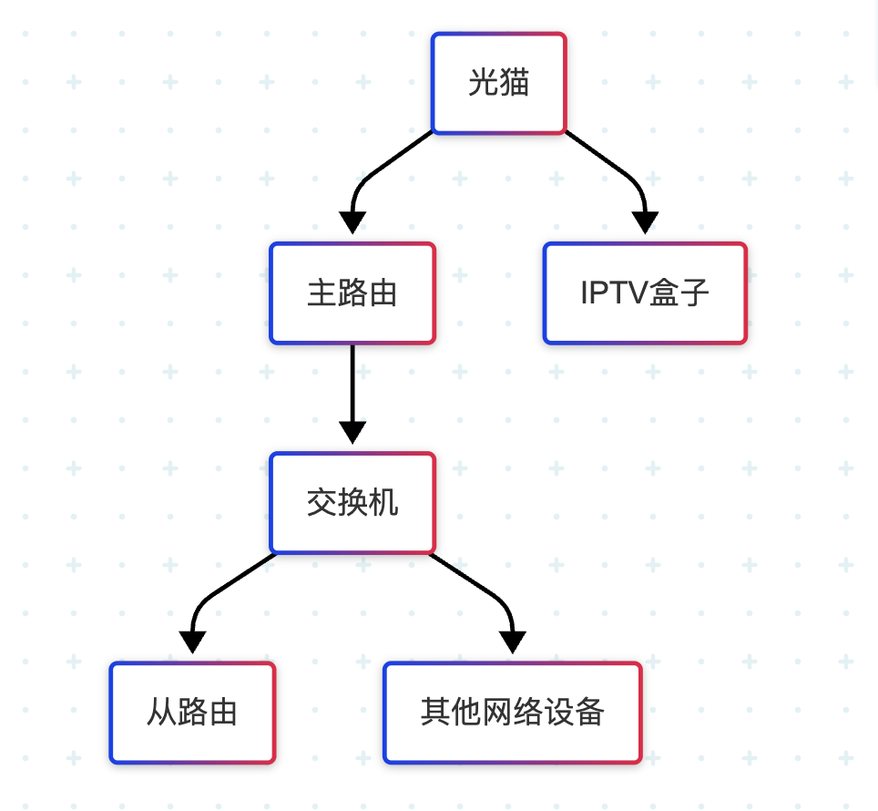
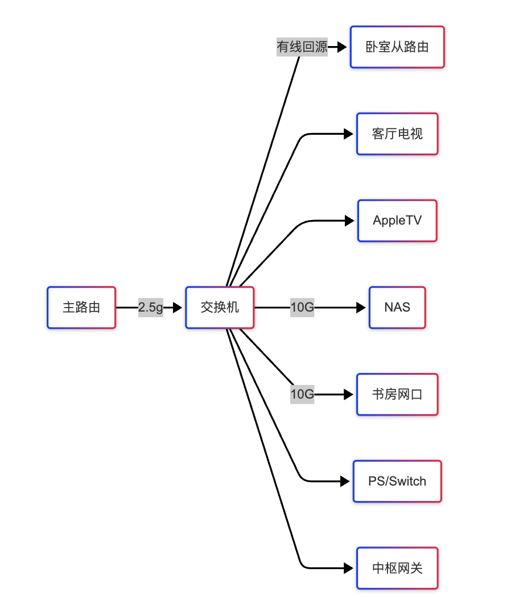
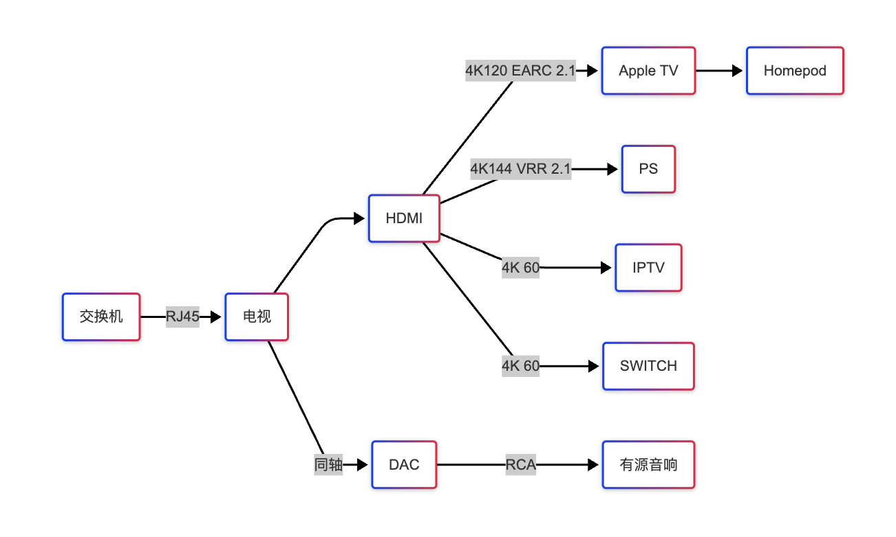

# 需求

路由器放在客厅,因为现代混凝土承重墙会植钢筋网,有比较大的屏蔽作用

为了保证卧室的 `5g频段` 速率,最实惠的方案是做有线 `MESH`,其次是`AC`+`AP`

## 网络需求

- 流畅游戏串流`1080p60帧`(Steam Link) `4k30帧`(Moonlight) `5g频段` `100m|百兆`带宽漫游可以满足

  延迟在 80ms, 输入延迟 20-30ms,解码延迟 20-30ms(AppleTV)

- 流畅 `4k` 播放 `5g频段` `1g|千兆`带宽漫游可以满足
- 流畅 `2k` 剪辑的主机到 `NAS` 需要 `2.5g|千兆` 的带宽
- 流畅 `4k` 剪辑保守起见需要 `10g|万兆`

## 电视需求

如果家庭成员有看电视的需求

需要 预留`IPTV`的单独线路

电视有三个方案:

1. 电视内置`APP` 付费网络流 (便宜,清晰度一般,可能不稳,有网络接入即可完全不需要线)
2. 电视使用运营商专用`APP`软解`IPTV` (稳定,需要地区支持,对电视性能有要求,电视性能太低软解帧率上不去)
3. 保留额外的一根网线连`IPTV`盒子 或者做 `VLAN`单线复用,通过盒子的`HDMI`接口连电视 (稳定,流畅 `4k`,有额外的线路成本)

## 信号质量

`AP`和`MESH`方案都可以做到无缝漫游

但是都需要有网线联通

`MESH`需要主从路由器之间有信号联通做回源

往往需要做`MESH`的前提就是无线信号不好了

无线回源会占用带宽,稳定性更不好

实际上只起到了把低质量的信号放大的作用,带宽和稳定性并不会有改善

`Wi-Fi 7`的话支持三频理论上可以用`5.8Ghz频段`做回源

但是还是不解决问题,毕竟高频信号的穿墙性能更差

所以保证网络质量`MESH`也是需要做有线连接的

信号放置上:

```markdown
吸顶 AP > 高位台面路由 > 低位电视柜路由 > 入户弱电柜
```

## 个人需求总结

1. 优先保证无线`5g频段`信号稳定覆盖 无缝漫游
2. 宽带套餐能给到`1g|千兆`的预算
3. 局域网内有线倾向`2.5g|千兆`
4. 主力`PC`连接热备`nas`倾向有条件上`10g|万兆`
5. 梯子方面暂时不考虑,后续有需走走`openwrt`的旁路由方案
6. 物联网设备,`Home Assistant`一定会装

   家电拉表看了下小米居多,会考虑直接上中枢网关,`2.4g频段`不会特别拥挤

## 取舍问题

### `MESH`还是`AC/AP`?

家庭网络从使用上限的角度,无线要求没那么高,`MESH`是够用的

`AC/AP`选择稍微好一点的做客厅和主卧双吸顶价格其实并没有跟`MESH`方案差多少

如果每个房间都做面板`AP` 那确实是会成本较高一些

`AP`的好处:

1. 客厅吸顶不占用地面空间,信号覆盖是会比低位的路由好
2. 支持`POE`供电,在卧室可以不考虑留强电插座
3. 后续接进其他`POE`设备会比较方便,比如摄像头,墙充,只需要网线不需要留强电

# 网络拓扑

## 主设备拓扑



## 交换机拓扑



## 电视机拓扑



## 安装

如果其他房间的有线都在弱电箱里不好改

那么弱电箱里放光猫和交换机

接线 `光猫` -> `主路由` -> `交换机`
算上`IPTV` 一共三根线

如果是毛坯装修 建议规划一个机柜位置

弱电箱里只放`光猫` 其他全插交换机上即可

后续升级也会方便很多

# 设备选择

## 宽带套餐

- 电信 价格最高,稳定达速,没有奇怪的屏蔽策略
- 移动 价格最低,高峰降速丢包,看视频没问题,打游戏雪崩
- 联通 中庸

正常都是光纤入户,会给你绑套餐

深圳的宽带应该是全国最黑的 下面列的是申报价 不含折扣

`2000M`宽带电信融合套餐 月实付 300 块 还是很肉疼的

`1000M`宽带电信融合套餐 月实付 199 块

电信新套餐也比较坑,只有`300M`,`1000M`,`2000M`可以选

联通宽带是电信的 7 折 移动宽带是电信的 5 折

套餐目前能聊到性价比最高的应该是联通的`1000M`79/月 三年合约

## 光猫

### 中兴 F7015TV3

- `10g|万兆`光口输入
- `2.5g|千兆`电口输出
- `IPTV`电口输出

不带 `Wi-Fi`,低功耗
放弱电箱用来桥接再合适不过了

为什么办`1g|千兆`宽带要`2.5g`网口?

运营商的指标在保证达速的情况下会多给 10%-20%的冗余 (没有的可以考虑投诉一下)

`2.5g`实际可以吃到`1.2g`实际的下行 和`0.4g`左右的上行

### 华为 P812E

- `2.5g|千兆`电口输出
- 四个`1g|千兆`电口输出
- 60w 的`POE`功率
- 自带路由

除了贵以外没毛病,小户型 All-in-One 的选择

## 交换机

### 普联 SE2109

- 八个`2.5g|千兆`电口
- 一个`10g|万兆`的`SFP+`光口

多设备不考虑万兆的话,性价比之选
有`VLAN`,可以链路聚合
加 300 块可以拿到`115w`的`POE`版本

### MikroTik CRS310

- 八个`2.5g|千兆`电口
- 两个`10g|万兆`的`SFP+`光口

早年的梦幻配置,现在看来也依然够用

万兆光口分别连书房 `PC` 和 `NAS`,就能较为便宜的覆盖需求

2025 年同配置可以考虑螃蟹方案 兮克的 `SKS3200-8E2X`

### 小米 万兆交换器

- 四个`2.5g|千兆`电口
- 两个`10g|万兆`的`SFP+`光口

营销大师系列

光转电的模块都比他贵! 真正的本体卖的比配件便宜

但是如果你不用光口的话,那是不值得买的,用别家的`2.5g|千兆`就好了

如果需要双光模块 建议上普联`SE2206` 铁壳更适合在弱电箱工作

### 兮克 83008T

- 八个`10g|万兆`电口

八个电口插满有 30w

# 速率规划验收

布局可以考虑去 `unifi` 注册完了白嫖一下无线覆盖的方案

## iperf3

```bash
brew install iperf3
```

https://github.com/esnet/iperf

设备之间打流就行了

## librespeed

https://github.com/librespeed/speedtest

同上

## netspot

无线检测

免费版不能导出,用来检测问题不大
