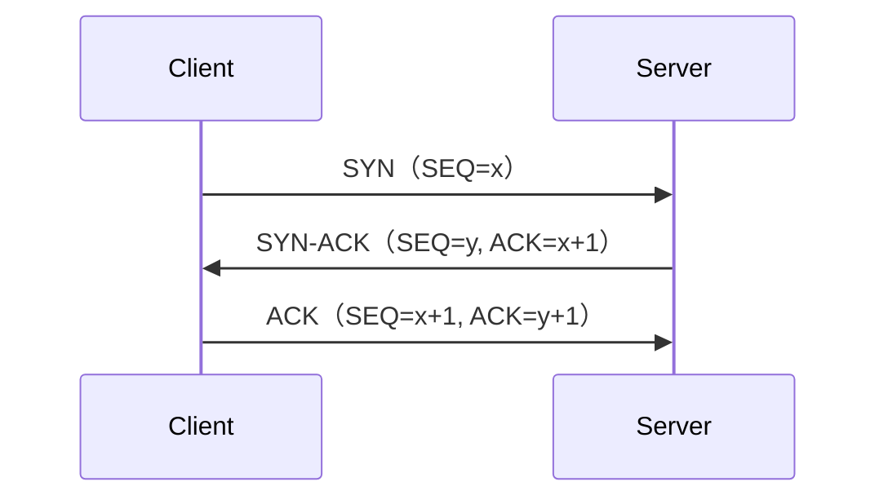
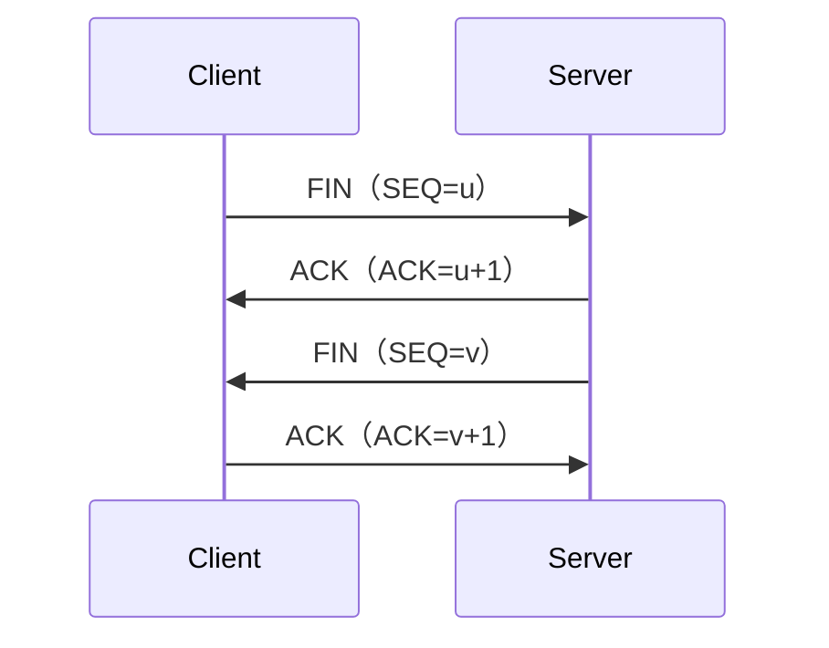
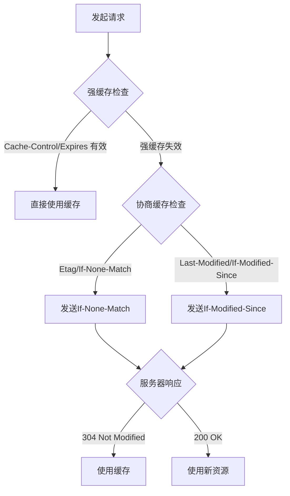
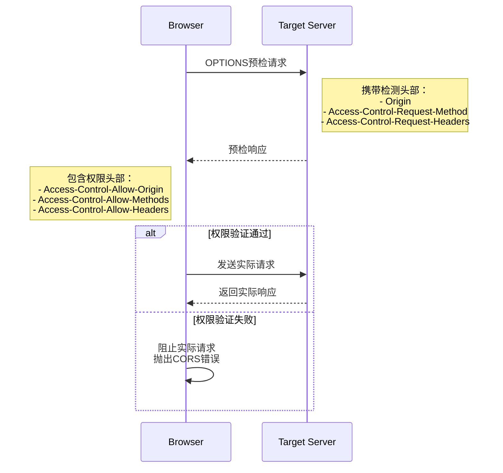
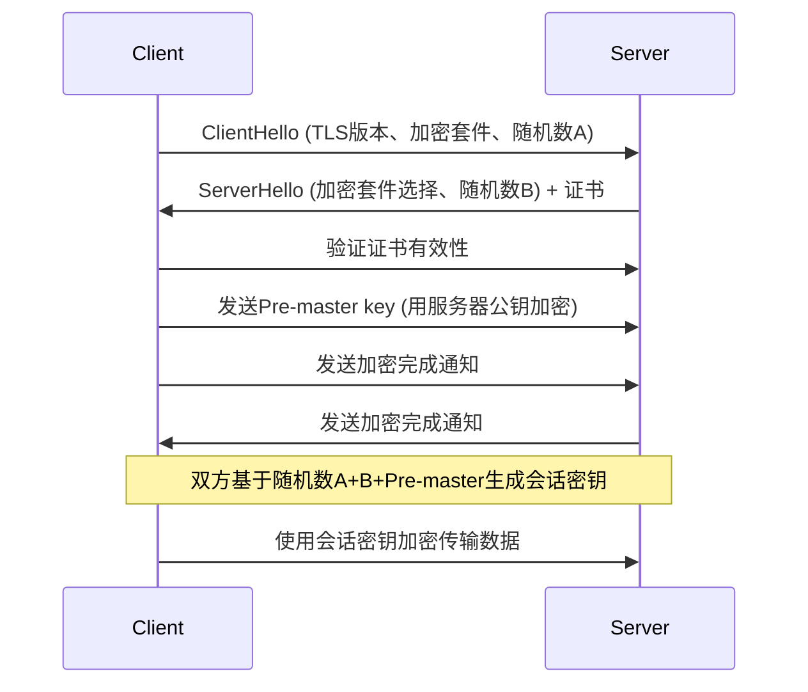

# DNS

## 解析涉及到什么协议

`DNS`协议工作在**应用层**
使用 UDP 协议，默认端口 53
当响应数据超过 512 字节时，会使用 TCP 协议

## DNS 解析过程

浏览器 → 本地 DNS 缓存 → 本地 DNS 服务器 → 根域名服务器 → 顶级域名服务器 → 权威域名服务器

### 浏览器

- 在地址栏输入：`chrome://net-internals/#dns`
- 然后点击 "Clear host cache" 按钮

### 本地 DNS 缓存

```bash
# host文件路径
cat /etc/hosts


# 使用nslookup进行调试
nslookup baidu.com]


# mac

# 查看 DNS 缓存
sudo dscacheutil -statistics

# 清除 DNS 缓存
sudo dscacheutil -flushcache
sudo killall -HUP mDNSResponder

# linux
# 查看 DNS 缓存
systemd-resolve --statistics

# 清除 DNS 缓存
sudo systemd-resolve --flush-caches
```

## 如何处理线上 DNS 污染

1. 根据 ip 进行拨测验证可用性
2. 如果是`NativeWbview`可以让客户端帮忙查相关解析日志和行为
3. 和客户沟通帮忙提供诊断信息

   模板话术
   麻烦您提供以下信息帮助我们定位问题：

   1. 执行 `nslookup 您的域名` 和 `nslookup 您的域名 8.8.8.8` 的 **完整截图**
   2. 访问域名时浏览器显示的 **具体错误代码**（如 ERR_CONNECTION_TIMED_OUT）
   3. 您使用的 **网络类型**（家庭宽带/公司网络/手机热点）
   4. 是否在 **其他设备**（如手机 4G）能正常访问？

# TCP/UDP

## UDP 和 TCP 区别

| 特性      | TCP                        | UDP                      |
| --------- | -------------------------- | ------------------------ |
| 连接      | 面向连接                   | 无连接                   |
| 可靠性    | 可靠（确认、重传）         | 不可靠                   |
| 有序性    | 保证顺序                   | 不保证顺序               |
| 速度      | 较慢                       | 较快                     |
| 头部大小  | 较大（20-60 字节）         | 较小（8 字节）           |
| 流量控制  | 有（滑动窗口）             | 无                       |
| 拥塞控制  | 有                         | 无                       |
| 应用场景  | 文件传输、网页浏览、邮件等 | 视频流、游戏、实时通信等 |
| 传输方式  | 字节流                     | 数据报文                 |
| 多播/广播 | 不支持                     | 支持                     |
| 资源占用  | 多                         | 少                       |
| 错误检测  | 检测并恢复                 | 检测（仅丢弃，不恢复）   |

## TCP 为什么可靠

## 为什么需要三次握手四次挥手

### 三次握手



- 同步初始序列号（ISN）
- 验证双向通信能力

### 四次挥手



- 确保双方数据发送完毕
- 防止旧连接数据混淆

## 不挥手会发生什么

没有正确的断开连接可能会持续消耗服务器的资源

一般服务端配置超时后连接强制关闭

# http

## 协议的缓存问题



## http/2

## 解决了 http1.1 的什么问题

多路复用: 解决队头阻塞 (浏览器对同一域名限制 6-8 个并发连接)

头部压缩 : 减少冗余数据传输 (Cookie/User-Agent)

服务器推送 : 预测性资源加载 (这个似乎已经被`chrome`干掉了,会展示`ERR_HTTP2_PUSH_DISABLED`)

流优先级 : 优化关键渲染路径

## http2 koa 实现

浏览器限制 `HTTP/2` 必须使用 `HTTPS`

### 本地签发证书

```bash
brew install mkcert
mkcert localhost
# 会得到 localhost-key.pem 和 localhost.pem 两个文件
```

出于安全考虑，因为 `HTTP/2` 的某些特性（如服务器推送）在非加密连接中可能被滥用

```js
import Koa from "koa";
import http2 from "http2";
import fs from "fs";
import path from "path";

const app = new Koa();

// SSL 证书配置
const options = {
  key: fs.readFileSync(path.join(__dirname, "certificates/private.key")),
  cert: fs.readFileSync(path.join(__dirname, "certificates/certificate.crt")),
  allowHTTP1: true, // 允许 HTTP/1.1 回退
};

// 创建 HTTP/2 服务器
const server = http2.createSecureServer(options, app.callback());

// 启动服务器
server.listen(3000, () => {
  console.log("Server running on https://localhost:3000");
});
```

## 什么是预检请求

预检请求(Preflight Request)`OPTIONS`,是浏览器在发送非简单跨域请求前自动发起的一种特殊 `HTTP`协议

它是跨域资源共享（`CORS`）机制的核心组成部分

用于安全地确认目标服务器是否允许实际的跨域请求

**根本目的是为了保护用户数据和服务器资源**

无需预检的场景(必须全部满足):

- 请求方法为简单方法 `GET`,`HEAD`,`POST `
- 请求头为简单头 `Accept`,`Accept-Language`,`Content-Language`,`Range`
- Content-Type 为简单值 `application/x-www-form-urlencoded`,`multipart/form-data`,`text/plain`

工作流程:



## 如何跨域

- `jsnop` (少用)
- 服务端反向代理
- 设置`CORS`请求头

# https

## 加密原理

一个标准加密套件包含四个组件

```text
TLS_ECDHE_RSA_WITH_AES_128_GCM_SHA256
```

- `TLS`: 协议
- 非对称加密: `ECDHE` 椭圆曲线交换初始秘钥;RSA 签名
- 对称加密: `AES_128_GCM` 传输数据
- 完整性校验: `SHA256`



会话秘钥是用 客户端随机数+服务端随机数+`Pre-masterKey` 生成的

因为非对称加密的特性,服务器传递的公钥只有私钥能解

只要私钥不泄露,可以保证用私钥加密的 `Pre-masterKey` 不会被非服务器方解出来导致内容泄露

客户端信任服务端是由证书(`CA`)保证的,服务端会在比较官方的机构进行注册颁发

## 中间人能看到什么

- `https` 只是一个头套,目的地址`ip`是不能隐藏的

  根据`ip`可以反推服务方,除非走隧道

  一般来说私人移动设备使用流量是很难被监控目的地址的(电信运营商可以做到)

- 证书用来防中间人,但是不能防用户

  其他人提供设备,可能预先信任私有证书

  或者自己的设备安装某个必要软件但是要求信任证书

  都会使整个链路的加密都失效

  摸鱼的时候要注意检查证书的颁发者
