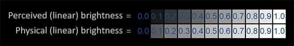
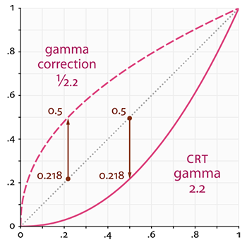
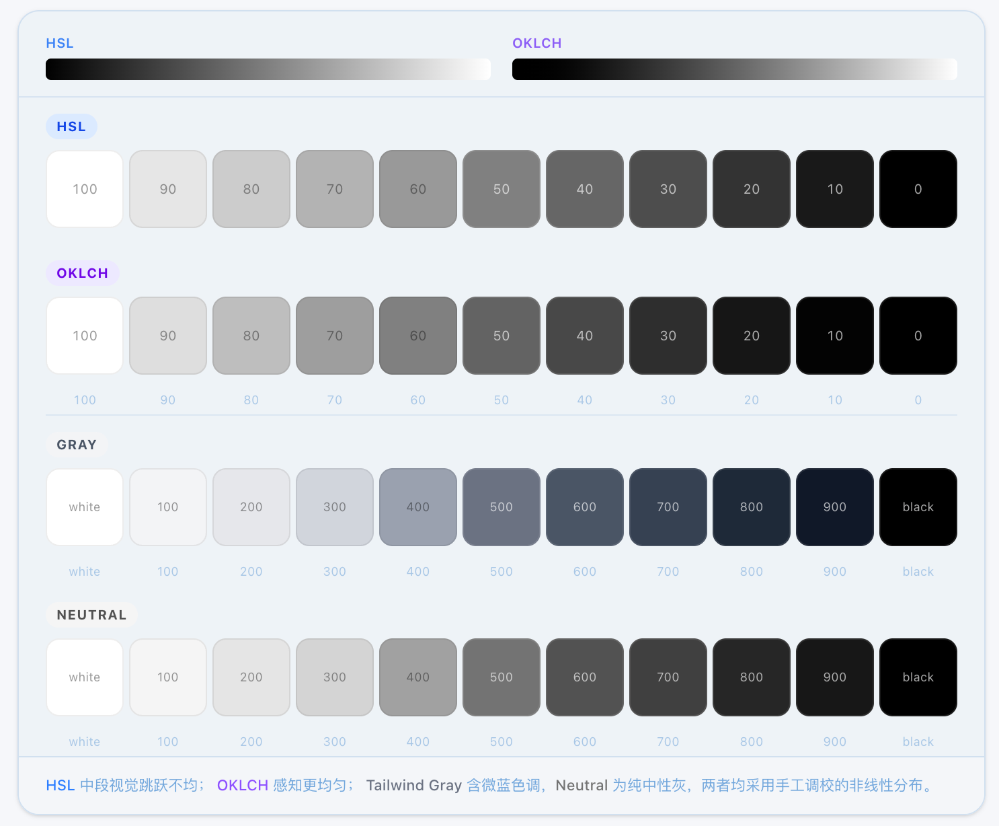
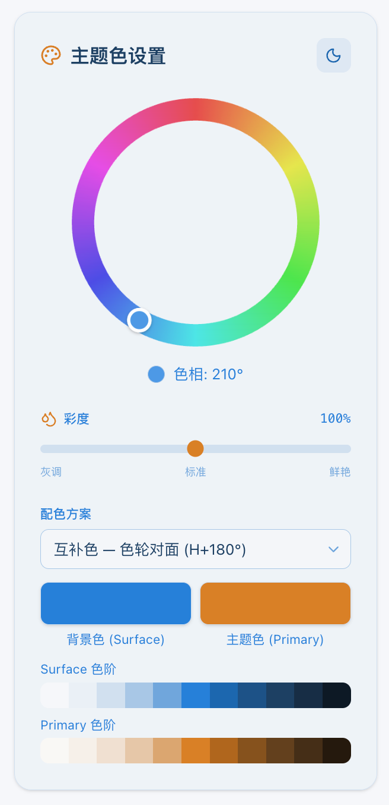
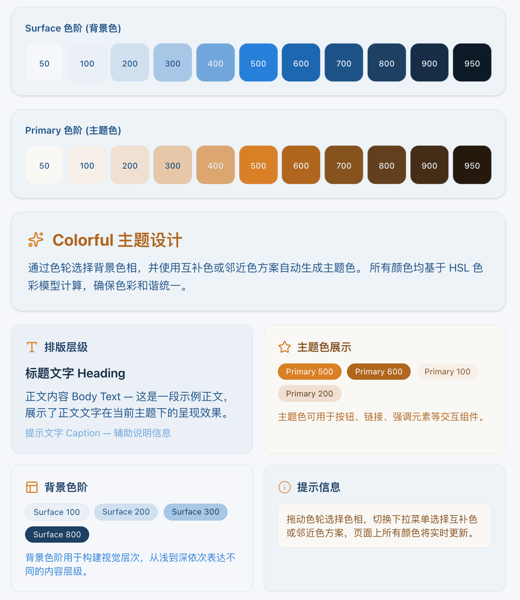
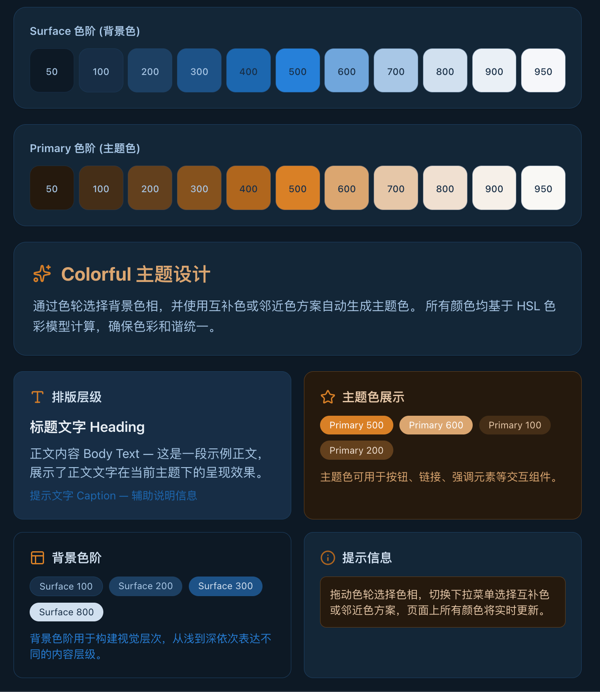

# `RGB` 和 `HSL`

**光谱**是连续的，眼睛通过**视锥细胞**对连续光谱进行采样，转换成可供感知的离散电信号。

- 在光谱上取三个分散的点以便均匀编码：
  - **长波红**
  - **中波绿**
  - **短波蓝**

**为什么是三个采样点？**

- 这是长期**进化权衡**的结果。
- 视网膜上的**感光细胞**个数是有限的。
- 提高不同波长的**视锥细胞**种类会降低总体的**分辨率**。

那提高感光区域大小来提高分辨率行不行呢？

现代相机图像传感器（`CMOS`）的采样也会有这样的困境。

- 不管是提高**分辨率**还是提高**颜色通道**，都会提高采样的**信息量**，是乘法关系。
- 巨量信息都受到**总线带宽**（神经）和**存储带宽**（大脑枕叶）处理能力的约束。

现代 `CMOS` 大多采用**拜耳阵列**的 `RGGB` 布局：

- 一个像素单元内：**一红**、**一蓝**、**两个绿**，共四个光照感应器。
- **绿**通道多是因为人眼对绿色波段**灵敏度高**。

> 实际上也可以选择 `RYYB` 布局：将传感器从绿光偏到波长更长的黄光，牺牲颜色还原，提高进光量，加强夜视能力。

如果按照 `RGB` 三个通道采集，并且分成 256 个（`8-bit`）亮度梯度，就可以得到原始的 `RGB` 定义：

```css
#ffffff 白色
#ff0000 红色
#00ff00 绿色
#0000ff 蓝色
#000000 黑色
```

但是人类其实对三变量的**数值感知**能力很差。在做颜色调整时，我们更倾向于这样表达：

- **偏冷 / 偏暖**一点（**色相** `Hue`）
- **浓 / 淡**一点（**饱和度** `Saturation`）
- **亮 / 暗**一点（**亮度** `Lightness`）

假设 `R`、`G`、`B` 的取值范围都在 $[0, 1]$ 之间。

### 第一步：找出极值

首先找到 `RGB` 中的最大值（$Max$）和最小值（$Min$）。

- **亮度（L）**的计算非常直观，它是最大值和最小值的平均数：

$$L = \frac{Max + Min}{2}$$

### 第二步：计算饱和度（S）

- 如果 $Max = Min$，说明 `R`=`G`=`B`，这是灰色，**$S = 0$**。
- 否则，根据亮度 $L$ 的位置来计算：
  - 如果 $L \le 0.5$：$S = \frac{Max - Min}{Max + Min}$
  - 如果 $L > 0.5$：$S = \frac{Max - Min}{2 - (Max + Min)}$

### 第三步：计算色相（H）

**色相**取决于哪个颜色分量占主导地位：

- 如果 **`R` 最大**：$H = \frac{G - B}{Max - Min}$
- 如果 **`G` 最大**：$H = 2.0 + \frac{B - R}{Max - Min}$
- 如果 **`B` 最大**：$H = 4.0 + \frac{R - G}{Max - Min}$
- 最后将 $H$ 乘以 $60^\circ$ 转换成角度；如果 $H < 0$，再加上 $360^\circ$。

> **饱和度**代表色彩的**纯净度**，即色相的突出程度。如果 `RGB` 没有某个颜色很突出、三个通道一样大，画面就只剩**明暗变化**。

# `Gamma`

人眼对光强的感知也不是线性的




为了适应黑暗生活的需要,人眼对暗部的感知能力要比亮部强不少.

**斯蒂文斯幂律** 人对物理刺激的感受是符合指数幂分布的

$$S = k \cdot I^a$$

也就是对数保持线性

$$\log(S) = \log(k) + a \cdot \log(I)$$

其中：
* **$S$ (Sensation)**：心理感觉量（打分值）。
* **$I$ (Intensity)**：物理刺激量（如光强、分贝、压力）。
* **$k$**：比例常数（取决于使用的单位）。
* **$a$**：**幂指数**（这是灵魂所在，代表了不同感官的“脾气”）。

实验计算下来数值在0.4-0.5之间


## 归一化

我们将亮度看作 $0$ 到 $1$ 之间的数值（$0$ 代表全黑，$1$ 代表全白）。

$$V_{out} = V_{in}^{0.45}$$

其中：
* $V_{in}$ 是**原始物理光强**（输入）。
* $V_{out}$ 是**编码后的电信号/数字值**（输出）。

假设我们关注物理上最暗的 $10\%$ 区域，即 $V_{in} = 0.1$。

我们将 $0.1$ 代入公式：

$$V_{out} = 0.1^{0.45} \approx 0.3548$$

这意味着，物理上只有 $10\%$ 的亮度，在经过伽马校正后，变成了信号中约 **35.5%** 的位置。

现在我们把这个比例应用到常见的 **8-bit 图像系统**中：

#### 情况 A：线性传输（不做伽马处理）
* **计算：** $255 \times 10\% = 25.5$
* **结论：** 物理暗部只分到了约 **25 个**数字等级来描述细节。如果你拍一张黑漆漆的照片，后期想提亮，你会发现暗部非常“粗糙”，因为一共就 25 个台阶。

#### 情况 B：伽马处理（使用 $0.45$ 曲线）
* **计算：** $255 \times 0.3548 \approx 90.5$
* **结论：** 同样的物理暗部，现在分到了约 **90 个**数字等级。

**对比：** 从 $25$ 个增加到 $90$ 个，细节的细腻程度提升了 **3.6 倍**。


## 细节是怎么丢失的

想象你在拍一个黑漆漆的巷子，墙角有一块砖头。
* 这块砖头的物理亮度极低，只有 **0.01**。
* 它的纹理变化（细节）极其微小，亮度只在 **0.010 到 0.011** 之间波动。

在光线变成数字信号之前，摄像机先用幂曲线把它“顶”上去。
* **计算：** $0.01^{0.45} \approx 0.125$
* **计算：** $0.011^{0.45} \approx 0.131$
* **结果：** 原本只有 **0.001** 的微小差距，现在变成了 **0.006** 的差距。这个差距被**放大了 6 倍**。

现在，我们要把这个连续的光信号存进一个 8-bit（0-255级）的容器里。

* **如果没有伽马压缩（线性）：**
    $0.010 \times 255 = 2.55$
    $0.011 \times 255 = 2.80$
    在电脑眼里，这两个数都会被四舍五入成 **3**。**细节丢了！** 砖头的纹理变成了一坨死黑。

* **有了伽马压缩：**
    $0.125 \times 255 = 31.8 \to$ **32**
    $0.131 \times 255 = 33.4 \to$ **33**
    由于数值被提前放大了，电脑现在能分出这是两个不同的数字（32 和 33）。**细节被成功捕捉并记录了下来！**


## 完整的链路

早期的CRT显示器偏转也符合幂率 一拍即合




完整的链路中，信号经历了两次变换：

1.  **编码端（摄像机/转换软件）：** 应用 $伽马 = \frac{1}{2.2}$。
    $$V_{signal} = L_{original}^{\frac{1}{2.2}}$$
    *这一步将物理光信号变成了电信号。由于曲线向上“拱”，暗部被拉伸了。*

2.  **显示端（CRT 或现代显示器）：** 应用 $伽马 = 2.2$。
    $$L_{display} = V_{signal}^{2.2}$$
    *这一步将电信号重新转回物理光。由于曲线向下“凹”，暗部被压回去了。*

3.  **最终合成：**
    $$L_{display} = (L_{original}^{\frac{1}{2.2}})^{2.2} = L_{original}^1$$

**结果：** 指数相乘最终显示的亮度 $L$ 与原始亮度是一比一对应的直线。


在实际的视频拍摄中（比如使用 **S-Log** 或 **V-Log** 等专业摄影机曲线），为了极致地保护阴影，厂家会使用比 $0.45$ 更“弯”的曲线。

以索尼的 **S-Log3** 为例，它为了模拟胶片的特性，会将极低亮度的分布推得更高。在这种特定的对数曲线下：
* 原本处于底层 $10\%$ 的物理光强，会被映射到信号中点（约 $50\%$ 或 $128/255$）的位置。
* 这样做的目的，就是为了让暗部拥有整整 **128 个**色阶的极高分辨率。

同样的原理也能解释日常拍摄过程中向右曝光的操作

> 向右曝光  在不让高光区域“溢出”（死白）的前提下，尽可能地增加曝光量，使直方图的像素分布尽量靠向右侧。

人为的在能接受高光破坏程度的情况下最大程度的过曝提高暗部的信噪比 

后期再通过压黑得到一个更加纯净的画面


# `OKLCH`

- 人眼对**暗光**更敏感，对不同**色相**的感受也不尽相同。
- **纯黄**和**纯蓝**在 `HSL` 里亮度值都是 50%，但人眼明显觉得黄色更亮。

为了做到**感知均匀**，有了 **`OKLCH`** 标准：

- **`L`（Lightness，感知亮度）**：衡量人眼感觉到的明暗程度。
- **`C`（Chroma，色度）**：类似于饱和度，但更符合物理真实感。
- **`H`（Hue，色相）**：颜色在色轮上的位置。

`OKLCH` 中 **`L` 相同**，大致可认为颜色的**视觉重量**一致（虽然物理亮度上黄色仍可能低于蓝色）。

下图是线性的物理亮度(基于HSL),感知亮度(基于OKLCH)和非线性(Tailwind配色)梯度图



## 主题色

- 做**换肤设计**时，只需调整 `OKLCH` 的 **色相**，就能得到偏粉的温馨主题或偏绿的森林系主题

还可以在角度上旋转180度得到对比色，或者加减30度得到邻近色用来配色。



- 使用一套通用的梯度就能保持**明暗关系**相对稳定。 

简单点用 `OKLCH` 的 **`L`** 做线性插值，并在两端微调，可以得到一个通用的**色阶**分布。

| 色阶 | `OKLCH` `L`（亮度） | 用途建议                |
| ---- | :-----------------: | ----------------------- |
| 50   |         97%         | 极淡背景 / 容器底色     |
| 100  |         92%         | 次级背景                |
| 200  |         84%         | 边框 / 禁用态           |
| 300  |         75%         | 辅助文字 / 图标         |
| 400  |         65%         | 次级交互色              |
| 500  |         55%         | 标准主色（`Primary`）   |
| 600  |         45%         | 悬停态（`Hover`）       |
| 700  |         35%         | 激活态（`Active`）      |
| 800  |         25%         | 强调文字                |
| 900  |         18%         | 标题文字                |
| 950  |         13%         | 深色模式背景 / 极深文字 |

并且色阶插值相差50就差不多能到`Google Lighthouse`推荐的4.5:1阅读对比度。 



- 更省事的是：**倒转亮度**即可得到对应的**深色模式**。



示例代码在[我的仓库里](https://github.com/kscarrot/colorful)

参考文档：

- [Google Material](https://github.com/material-components/material-web/blob/main/docs/theming/color.md)
- [Tailwind CSS](https://tailwindcss.com/docs/colors)
- [Gamma](https://learnopengl.com/Advanced-Lighting/Gamma-Correction)
